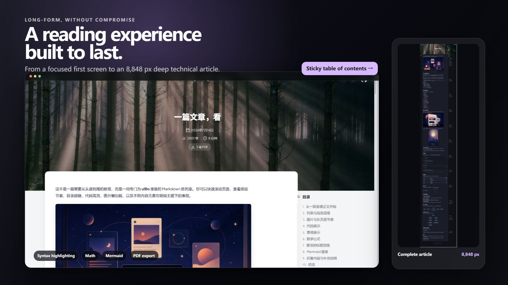
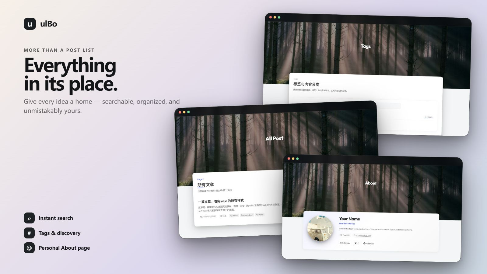

# ulBo Astro Theme

<p align="center">
  <strong>An Astro personal blog theme built for visual expression, long-form reading, and a disciplined publishing workflow.</strong>
</p>

<p align="center">
  <a href="./README.md">中文</a> ·
  <a href="./README.en.md">English</a>
</p>

<p align="center">
  <a href="https://astro.build/"></a>
  <a href="https://nodejs.org/"></a>
  <a href="./LICENSE"></a>
</p>

<p align="center">
  <a href="https://template.ulna520.top"><strong>Live demo</strong></a> ·
  <a href="https://blog.ulna520.top">Real-world blog</a> ·
  <a href="https://astro.build/themes/details/ulbo/">Astro Theme Store</a> ·
  <a href="https://github.com/xxy1103/ulbo_vscode">VS Code Article Manager</a>
</p>


## Why ulBo

ulBo is designed for writers, developers, and independent creators who want a personal site with a distinct visual identity without giving up content structure, search, SEO, or maintainability. It combines a cinematic interface with serious long-form reading tools and a configuration model that stays approachable as the blog grows.

| Area | What ulBo provides |
| --- | --- |
| **Visual design and motion** | Immersive heroes, responsive layouts, light and dark themes, and Astro View Transitions tuned with Material Design 3 easing curves. |
| **Long-form reading** | Sticky table of contents, word count, reading time, copyable code, KaTeX, Mermaid, image lightbox, and print-optimized PDF export. |
| **Content discovery** | Fuse.js fuzzy search, a `Cmd/Ctrl + K` shortcut, archives, interactive tag filtering, and pagination. |
| **Publishing quality** | Strict Frontmatter, production draft isolation, RSS, sitemap, canonical URLs, Open Graph, Twitter Cards, and JSON-LD. |
| **Configuration and migration** | Centralized site, profile, and hero configuration with Markdown / MDX and Hexo-style image-path compatibility. |
| **Performance engineering** | Lazy images, async decoding, on-demand KaTeX, deferred search data, prefetching, and an explicit WebP optimization workflow. |

## Theme Preview

<table>
  <tr>
    <td width="50%"></td>
    <td width="50%"></td>
  </tr>
  <tr>
    <td align="center"><strong>Consistent light and dark experiences</strong></td>
    <td align="center"><strong>Reading tools for technical long-form content</strong></td>
  </tr>
</table>



## Optional VS Code Writing Companion

[ulBo Article Manager](https://github.com/xxy1103/ulbo_vscode) is an optional VS Code extension designed specifically for this theme. It keeps the daily publishing workflow beside the Markdown editor:

- Create drafts and search, filter, or open existing posts.
- Edit titles, dates, descriptions, categories, tags, and draft state from a visual sidebar.
- Generate article descriptions through the VS Code language model, with a local extraction fallback.
- Start the Astro development server and open the current article preview.
- Validate Frontmatter, tags, and referenced images before publishing.
- Stage only the article and its related images in Git.
- Move deleted posts to the system recycle bin so they remain recoverable.

The theme handles presentation and builds; the companion handles writing and article management. It never commits, pushes, or deploys automatically, so the final release remains under your control.

The current release is distributed as a local VSIX from the companion repository. See the [ulBo Article Manager README](https://github.com/xxy1103/ulbo_vscode#readme) for installation and scope.

## Overview

- Responsive blog structure with home, archive, tags, about, and article pages.
- User-facing configuration is centralized in `src/config/`, making template customization fast.
- Zero-content friendly: `src/content/blog/` can be empty while core pages still build.

## Feature Highlights

1. Responsive blog layout (`/`, `/blog`, `/tags`, `/about`)

    - Page-level breakpoints and mobile adaptation: `src/pages/*.astro`, `src/styles/global.css`
    - Mobile navigation drawer: `src/components/Header.astro`

2. Strict article contract and draft protection

    - Frontmatter uses the unified `title/date/updated/description/draft/categories/tags` fields
    - Drafts remain visible with a draft badge in development and are excluded from every production content output
    - Categories are arrays with at most one item; published posts require one category and at least one tag
    - Strict schema and conditional validation: `src/lib/content/frontmatter-schema.ts`
    - Hexo-style relative image path compatibility (`image/...` -> `/image/...`): `src/plugins/remark-hexo-images.mjs`

3. Smooth animation design (Material Design curves)

    - Page transitions built with View Transitions: `src/components/BaseHead.astro`
    - Material Design 3 easing curves (Emphasized/Decelerate/Accelerate) are used for page and interaction transitions: `src/components/BaseHead.astro`, `src/components/SearchModal.astro`

4. SEO optimizations (implemented items only)

    - See the "SEO Optimizations (Code-Aligned)" section below.

5. KaTeX math support

    - Markdown pipeline: `remark-math` + `rehype-katex` (`astro.config.mjs`)
    - KaTeX stylesheet is loaded on demand (only when math content is detected): `src/pages/blog/[...slug].astro`, `src/layouts/BlogPost.astro`

6. Built-in WebP image optimization flow

    - Image optimization is independent from normal builds, so `npm run build` never modifies posts or image assets.
    - Preview with `npm run optimize:images:dry-run`, then explicitly run `npm run optimize:images` after review.

7. Lighthouse-oriented performance optimizations

    - Includes image lazy loading, async decoding, targeted preloading, deferred search index loading, and viewport-external rendering optimizations.
    - See the "Lighthouse-Oriented Performance Optimizations (Code-Aligned)" section below.

## SEO Optimizations (Code-Aligned)

Every item below can be directly verified in the current codebase:

1. Canonical, robots, Open Graph, Twitter Card, and JSON-LD injection

    - `src/components/BaseHead.astro`

2. Home page `WebSite` structured data

    - `src/pages/index.astro`

3. About page `Person` structured data

    - `src/pages/about.astro`

4. Article page `BlogPosting` structured data + `article:*` meta

    - `src/layouts/BlogPost.astro`

5. Archive pagination SEO strategy: `/blog/page/2+` is `noindex,follow`, with `rel=prev/next`

    - `src/pages/blog/[...page].astro`

6. Sitemap filtering strategy: excludes tag pages and `/blog/page/2+` archive pages

    - `astro.config.mjs`

7. RSS output and description fallback chain (frontmatter description -> extracted body summary -> title)

    - `src/pages/rss.xml.js`
    - `src/lib/content/text.ts`

8. Important scope boundary

    - Tag pages are not explicitly set to `noindex` in current code (`/tags` and `/tags/[tag]` do not pass `noindex`), so this README does not claim that behavior.

## Lighthouse-Oriented Performance Optimizations (Code-Aligned)

All items below are traceable in code:

1. Unified Markdown image lazy loading + async decoding

    - `src/plugins/rehype-lazy-images.mjs`

2. Build-time WebP conversion + Markdown reference replacement

    - `scripts/optimize-blog-images.mjs`

3. Explicit, previewable image optimization flow

    - `npm run optimize:images:dry-run` performs no writes.
    - `npm run optimize:images` generates WebP files and replaces Markdown references.

4. Article hero image preload + on-demand KaTeX stylesheet loading

    - `src/layouts/BlogPost.astro`

5. KaTeX font display patch (`font-display: block` -> `swap`)

    - `astro.config.mjs`

6. Lazy fetch of search index (load only when search modal is first opened)

    - `src/scripts/search/repository.ts`

7. Theme initialization anti-flash logic

    - `src/components/BaseHead.astro`

## Quick Start

```bash
npm install
npm run dev
```

Build:

```bash
npm run build
```

Preview:

```bash
npm run preview
```

## Use As Template (Detailed Guide)

### 1) Prerequisites

- Node.js 22.12.0 or newer
- npm 9.6.5 or newer
- The repository includes `.nvmrc`; run `nvm use` to select the project version

### 2) Create your project from GitHub Template

1. Open this repository on GitHub and click **Use this template**.
2. Create your own new repository (public and private repositories are both supported).
3. Clone your new repository locally.

### 3) Initialize locally and run

```bash
npm install
npm run dev
```

Default local URL is typically: `http://localhost:4321`

### 4) Update site configuration

Edit these files first:

- `src/config/site.ts`
- `src/config/profile.ts`
- `src/config/hero.ts`

`src/config/index.ts` is an export aggregator and usually does not need direct edits.

### 5) Add blog content

Put posts in `src/content/blog/`, with `.md` or `.mdx`.

Sample Frontmatter:

```md
---
title: "My First Post"
date: "2026-02-11T10:00:00+08:00"
updated: "2026-02-12T18:30:00+08:00"
description: "A short description used for SEO and list excerpts."
draft: false
categories:
  - "Tutorial"
tags:
  - "astro"
  - "markdown"
---

Post body...
```

Notes:

- `title`, `date`, `categories`, and `tags` are required; categories and tags must use YAML block arrays.
- Dates use ISO 8601 strings with an explicit `+08:00` timezone.
- `draft` can be omitted and defaults to `false`.
- `draft: true` allows `categories: []` and `tags: []`.
- Published posts require exactly one category, at least one tag, and no duplicate tags.
- `pubDate`, `updatedDate`, string categories/tags, and other legacy fields are no longer supported.
- All posts use the default background configured in `src/config/hero.ts`; per-post `heroImage` is not supported.
- See `standard/frontmatter.md` for the complete contract.

Check all article Frontmatter without writing files:

```bash
npm run frontmatter:check
```

After reviewing the result, explicitly normalize the files with:

```bash
npm run frontmatter:fix
```

The fixer rewrites Frontmatter only and verifies the article body hash before writing.

### 6) Images and WebP optimization flow

1. Put images in `public/` (for example `public/image/...`).
2. Reference `.png/.jpg/.jpeg` images in your posts.
3. Preview the conversion without writing images or Markdown:

```bash
npm run optimize:images:dry-run
```

4. After reviewing the result, explicitly run the conversion:

```bash
npm run optimize:images
```

Both `npm run build` and `npm run build:astro` only build the site and never trigger image conversion.

Optional advanced args (run script directly):

```bash
node scripts/optimize-blog-images.mjs --max-width 1600 --quality 78
```

Use `--force` to bypass the option-aware cache and regenerate files. The cache lives in `.astro/` and is not committed.

### 7) Build and preview

```bash
npm run build
npm run preview
```

### 8) Deployment

Cloudflare Workers Static Assets is recommended. The repository includes `wrangler.jsonc`; after connecting the GitHub repository, configure:

- Build command: `npm run build`
- Deploy command: `npm run deploy`
- Root directory: `/`
- Node.js: `22.12.0` (also pinned by `.nvmrc`)

Cloudflare will build and deploy `dist/` automatically after pushes to the production branch. To deploy manually after authenticating with Cloudflare, run:

```bash
npm run build
npm run deploy
```

The project can also be deployed to Cloudflare Pages, Vercel, or Netlify using `dist/` as the build output directory.

### 9) Receiving Future Theme Updates (Template Sync)

If your repository was created from GitHub Template, keep the original theme repo as `upstream` and sync regularly.

Initial setup (one-time):

```bash
git remote add upstream https://github.com/xxy1103/ulbo-astro-theme-template.git
git remote -v
```

Regular sync workflow:

```bash
git fetch upstream
git checkout main
git pull origin main
git merge upstream/main
```

Recommended verification after syncing:

```bash
npm install
npm run build
```

If conflicts occur:

1. Prefer keeping your site-specific configuration (for example `src/config/*`).
2. Resolve conflicts, then create a merge commit.
3. If you do not want a full merge, selectively import commits instead:

```bash
git log --oneline upstream/main
git cherry-pick <commit_sha>
```

## Configuration Reference

### `src/config/site.ts` (`SiteConfig`)

- `siteUrl`: production site URL (base URL for canonical/sitemap/RSS)
- `siteTitle`: site title
- `siteDescription`: default description
- `locale`: locale in BCP-47 format (for example `zh-CN`)
- `headerGithubRepoUrl`: repository URL shown in header
- `faviconIco`: global favicon path (served from `public/`)

### `src/config/profile.ts` (`ProfileConfig`, `ProfileSocialLink`)

- `avatar`: optional avatar URL
- `name`: name (about page, structured data, footer)
- `title`: personal title/role
- `bio`: biography
- `location`: optional location
- `email`: optional email
- `githubProfileUrl`: personal GitHub profile URL
- `socials`: social link array
- `socials[].key`: `github | x | email | website`
- `socials[].label`: display label
- `socials[].url`: link URL

### `src/config/hero.ts` (`HeroConfig`, `HeroSectionConfig`)

- `home.text` / `home.subtitle` / `home.backgroundImage`
- `blog.text` / `blog.subtitle` / `blog.backgroundImage`
- `tags.text` / `tags.subtitle` / `tags.backgroundImage`
- `about.text` / `about.subtitle` / `about.backgroundImage`
- `postDefaultBackground`: shared default hero image for every article page

### `src/content.config.ts` (Strict blog Frontmatter contract)

Required fields:

- `title`
- `date`
- `categories` (string array, at most one item)
- `tags` (string array)

Optional fields:

- `description`
- `updated`
- `draft` (boolean, defaults to `false`)

Conditional validation:

- Drafts may have empty categories and tags, but can never have more than one category.
- Published posts require exactly one category and at least one tag.
- Taxonomy and text fields are trimmed and empty strings are rejected.
- Duplicate tags and undeclared legacy fields fail content validation.
- Production uses `getBlogPosts()` as the single draft filter for home, archive, detail routes, tags, search index, and RSS.

## Project Commands

These commands match `package.json` exactly:

| Command                         | Description                                             |
| :------------------------------ | :------------------------------------------------------ |
| `npm run dev`                   | Start the local development server                      |
| `npm run build`                 | Build the site without modifying posts or image assets  |
| `npm run build:astro`           | Explicit alias for `astro build`                        |
| `npm run check`                 | Run `astro check` for type/template validation          |
| `npm run frontmatter:check`     | Read-only validation of all article Frontmatter         |
| `npm run frontmatter:fix`       | Normalize Frontmatter without changing article bodies   |
| `npm run preview`               | Preview the production output                           |
| `npm run astro`                 | Native Astro CLI entry                                  |
| `npm run optimize:images`       | Generate WebP files and replace blog image references   |
| `npm run optimize:images:dry-run` | Preview image optimization without writing files      |

## Post-refactor Conventions (2026-02)

- Use `src/layouts/PageShell.astro` for standard page shells (post detail remains on `BlogPost` layout).
- Centralize blog content reads in `src/lib/content/blog.ts` instead of repeating `getCollection` logic per page.
- Use `src/lib/content/text.ts` for excerpts and SEO description extraction.
- Use `src/lib/profile/social.ts` for social link normalization and sameAs generation.
- Place page interaction scripts in `src/scripts/pages/*` and register them via `src/scripts/pages/registry.ts`.
- See `docs/frontend-architecture-map.md` for the dependency and page relationship map.

## Open Source Collaboration

- Contribution guide: `CONTRIBUTING.md`
- Code of Conduct: `CODE_OF_CONDUCT.md`
- Security policy: `SECURITY.md`
- Issue templates: `.github/ISSUE_TEMPLATE/`
- CI workflow: `.github/workflows/ci.yml`
- Deployment workflow: `.github/workflows/deploy.yml`

Issues and PRs are welcome, especially for deeper Hexo migration compatibility, SEO refinements, and performance improvements.

## License

This project is licensed under the MIT License. See `LICENSE`.
