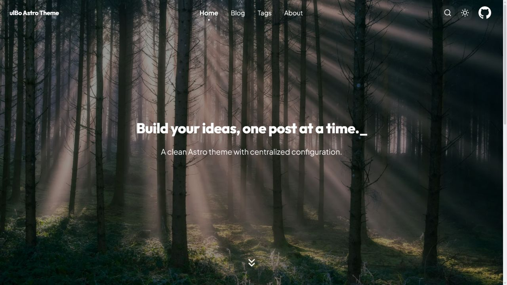

# ulBo Astro Theme

[中文](./README.md) · [English](./README.en.md)

[](https://astro.build/)
[](https://nodejs.org/)
[](./LICENSE)

一个简洁、响应式、开箱即用的 Astro 个人博客主题。

[在线预览](https://template.ulna520.top) · [个人博客示例](https://blog.ulna520.top) · [VS Code 文章管理插件](https://github.com/xxy1103/ulbo_vscode)



## 特点

- **专注阅读**：简洁的文章排版、明暗主题、响应式布局和页面过渡。
- **内容完整**：内置首页、文章归档、标签、About、全文搜索、RSS 和站点地图。
- **适合技术写作**：支持 Markdown、MDX、代码高亮、KaTeX 公式和 Mermaid 图表。
- **草稿安全**：开发环境可查看草稿，生产构建会从页面、搜索和 RSS 中排除草稿。
- **SEO 友好**：包含 Canonical、Open Graph、Twitter Card 和 JSON-LD。
- **图片优化**：提供可预览的 WebP 转换流程，普通构建不会修改文章或图片。
- **方便迁移**：站点、个人资料和首页展示内容集中在 `src/config/`。

## 快速开始

点击 GitHub 仓库中的 **Use this template** 创建自己的博客，然后运行：

```bash
npm install
npm run dev
```

默认访问地址为 `http://localhost:4321`。

环境要求：

- Node.js 22.12.0 或更高版本
- npm 9.6.5 或更高版本

## 配置博客

通常只需要修改以下文件：

| 文件 | 用途 |
| --- | --- |
| `src/config/site.ts` | 网站地址、标题、描述和仓库链接 |
| `src/config/profile.ts` | 头像、个人介绍和社交链接 |
| `src/config/hero.ts` | 首页与各页面的标题、背景图 |
| `src/content/blog/` | Markdown / MDX 文章 |
| `public/image/` | 文章与页面图片 |

## 写一篇文章

在 `src/content/blog/` 中新建 `.md` 或 `.mdx` 文件：

```md
---
title: "我的第一篇文章"
date: "2026-08-03T10:00:00+08:00"
description: "介绍如何使用 ulBo 搭建个人博客，包括主题配置、文章写作、本地预览、图片优化与部署流程。"
draft: false
categories:
  - "记录"
tags:
  - "astro"
  - "blog"
---

正文从这里开始。
```

完整字段与校验规则见 [Frontmatter 标准](./standard/frontmatter.md)。

## 推荐搭配 ulbo Article Manager

[ulbo Article Manager](https://github.com/xxy1103/ulbo_vscode) 是专门为本主题开发的 VS Code 插件，可以直接在编辑器中：

- 新建、搜索和筛选文章；
- 编辑 Frontmatter，无需手动维护 YAML；
- 启动本地预览并打开当前文章；
- 校验文章与图片，准备发布文件。

主题负责博客的展示与构建，插件负责日常写作和文章管理，两者可以独立使用，也可以配合使用。

## 常用命令

| 命令 | 说明 |
| --- | --- |
| `npm run dev` | 启动开发服务器 |
| `npm run build` | 构建生产版本 |
| `npm run preview` | 预览构建结果 |
| `npm run check` | 检查 Astro 与 TypeScript |
| `npm test` | 运行测试 |
| `npm run frontmatter:check` | 只读检查文章 Frontmatter |
| `npm run optimize:images:dry-run` | 预览图片优化结果 |
| `npm run optimize:images` | 转换 WebP 并更新文章引用 |

## 部署

项目输出为静态文件，可部署到 Cloudflare、Vercel、Netlify 或 GitHub Pages。

仓库已包含 Cloudflare Workers 配置：

```bash
npm run build
npm run deploy
```

使用其他平台时，将构建命令设为 `npm run build`，输出目录设为 `dist`。

## 相关项目

- [ulbo Article Manager](https://github.com/xxy1103/ulbo_vscode)：配套的 VS Code 文章管理插件。
- [xxy1103.github.io](https://github.com/xxy1103/xxy1103.github.io)：使用 ulBo 搭建的个人博客仓库。

## 参与贡献

欢迎提交 Issue 和 Pull Request。开始前请阅读 [贡献指南](./CONTRIBUTING.md) 与 [行为准则](./CODE_OF_CONDUCT.md)。

## 许可证

[MIT](./LICENSE)
