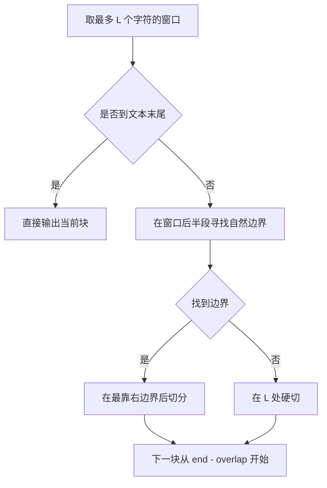
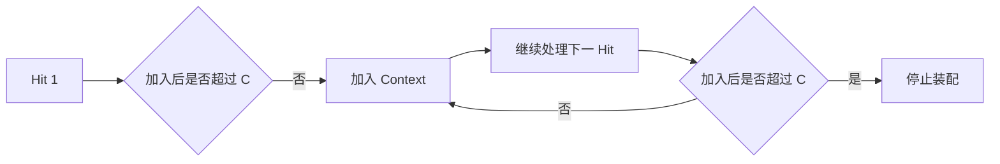

在这世间 有一种被称为明天的未来，将小小的泪珠变化为大大的花儿

<!-- more -->

> 文档性质：当前实现的算法设计、工程映射与能力边界说明
> 代码核对日期：2026-08-24
> 当前实现：Vanilla Dense RAG

## 1. 这个项目解决什么问题

大语言模型可以根据输入生成自然语言，但它并不会自动知道本地文档中的内容。即使模型训练时接触过相似知识，也无法保证知识是当前版本、来自指定资料，或能给出可追溯来源。

Base RAG 解决的问题是：

> 给定一批本地 PDF、Markdown 和 HTML 文档，如何在用户提问时找出最相关的原文片段，并让大语言模型只根据这些片段回答，同时保留来源引用？

RAG 是 Retrieval-Augmented Generation，即“检索增强生成”。它不要求模型提前记住所有文档，而是把“查资料”和“组织答案”拆成两个阶段：

1. **Retrieval（检索）**：从本地知识库中找出与问题最相关的文本片段；
2. **Generation（生成）**：把问题和检索证据一起交给大语言模型生成答案。


如果没有 RAG，模型面对问题时只能依赖自身参数中的知识；加入 RAG 后，模型回答前会先收到一份针对当前问题动态选择的“开卷资料”。

### 1.1 当前实现的范围

当前项目实现的是一条透明、可读的 Vanilla Dense RAG 链路：

```text
Document → Chunk → Embedding → FAISS → Top-K → Prompt → LLM → Answer
```

当前支持：

- 本地 Markdown、MDX、HTML、文本型 PDF；
- 标题感知的字符切块与重叠；
- Dense Embedding 语义检索；
- FAISS `IndexFlatIP` 精确搜索；
- 相似度阈值、上下文预算与无证据拒答；
- 文件名、Markdown 章节或 PDF 页码引用；
- 问答过程持久化与基础 Hit@K 评估。

## 2. 系统输入、输出与两阶段结构

RAG 系统被拆成“离线建库”和“在线问答”两个阶段。


| 阶段     | 输入                               | 核心计算                              | 输出                                                 |
| -------- | ---------------------------------- | ------------------------------------- | ---------------------------------------------------- |
| 离线建库 | 本地语料、切块配置、Embedding 模型 | 清洗、切块、向量化、建索引            | `index.faiss`、`chunks.jsonl`、`metadata.json` |
| 在线问答 | 用户问题、已建索引、检索与生成配置 | 问题向量化、Top-K、证据拼装、LLM 生成 | 回答、引用、检索轨迹                                 |

离线建库通常在语料或 Embedding 配置变化后执行一次；在线问答可以复用同一份索引处理多个问题。

### 2.1 模块职责


| 文件             | 工程职责                               |
| ---------------- | -------------------------------------- |
| `models.py`    | 定义跨模块传递的数据结构               |
| `loaders.py`   | 隔离文件格式差异                       |
| `chunking.py`  | 实现可复现的切块算法                   |
| `embedding.py` | 适配模型服务、批处理与重试             |
| `store.py`     | 管理 FAISS 索引及 Chunk 映射           |
| `pipeline.py`  | 编排`ingest()` 和 `ask()`          |
| `config.py`    | 加载 YAML、解析路径并校验参数          |
| `cli.py`       | 暴露`ingest`、`ask`、`eval` 命令 |

## 3. 三个核心数据对象

不同文件格式最终都要进入同一条算法链路。项目用三个数据对象表示加工过程中的不同阶段：


`SourceDocument`：统一文档表示

```Python
SourceDocument(
    source_id="a1b2c3...",
    text="KDD Cup 2026 Data Agents ...",
    source_path="A:\\XXY\\RAG\\data\\raw\\KDD Cup....md",
    media_type="markdown",
    title="KDD Cup 2026 Data Agents",
    page=None,
    section=None,
    metadata={"frontmatter": {...}},
)
```

`SourceDocument` 表示 Loader 已经读取和清洗、但尚未切块的文档。它保存正文 `text`，也保存 `source_path`、`media_type`、`title`、`page` 和扩展 `metadata`。

这种设计把格式差异隔离在 Loader 内部。后续切块算法只处理统一对象，不需要再次判断输入是 PDF 还是 Markdown。

`Chunk`：检索的最小知识单元

```Python
Chunk(
    chunk_id="d98e...",
    text="比赛强调数据理解、工具调用……",
    source_id="a1b2c3...",
    source_path="...",
    media_type="markdown",
    ordinal=3,
    title="KDD Cup 2026 Data Agents",
    section="比赛能力要求",
)
```

`Chunk` 表示真正参与 Embedding 和检索的文本块。它不仅保存正文，还复制来源 ID、路径、标题、页码和章节。这是有意的数据冗余：索引重新加载后，不需要再次解析原文件，就能从一个 Chunk 直接恢复证据正文和引用位置。

`SearchHit`：查询相关性结果

```Python
SearchHit(
    chunk=某个 Chunk,
    score=0.82,
    rank=1,
)
```

* `chunk`：命中的那个完整 Chunk，包含文本、标题、章节、来源等。
* `score`：问题向量与 Chunk 向量的相似度。项目使用归一化向量的内积，也就是余弦相似度。
* `rank`：本次结果中的名次，`1` 代表最相关。

## 4. 离线建库算法

离线建库的目标是把原始文件转换成一组可检索的向量，同时保留每个向量对应的正文和来源。当前流程依次经过五个模块：

```text
loaders.py → chunking.py → embedding.py → store.py → pipeline.py
原始文件      文本块          向量             索引          统一编排
```

前四个模块分别完成一种数据转换，`pipeline.py` 最后将它们串成完整的 `ingest` 流程。本章只讨论建库，不展开问题检索和答案生成。

### 4.1 `loaders.py`：把不同文件统一成文档对象

`loaders.py` 接收单个文件路径，根据扩展名选择对应的解析方式，并统一返回 `list[SourceDocument]`。下游模块因此不需要理解 PDF、Markdown 和 HTML 的格式差异，只需处理统一的正文与来源字段。

| 格式           | 读取与清洗                                                                            | 保留的定位信息                 |
| -------------- | ------------------------------------------------------------------------------------- | ------------------------------ |
| Markdown / MDX | 读取 UTF-8 文本；分离 Front Matter；移除注释和 MDX import/export；图片只保留 alt 文本 | 标题、原始路径、Front Matter   |
| HTML           | 使用 BeautifulSoup 提取正文；删除脚本、样式、导航、页眉和页脚等噪声                   | `<title>` 或文件名、原始路径 |
| PDF            | 使用 PyMuPDF 按页提取文字；跳过空白页                                                 | 文件名、原始路径、页码         |

Markdown 的标题依次取 Front Matter 中的 `title`、第一个一级标题和文件名。PDF 每个有效页面会生成一个 `SourceDocument`，因此一份 PDF 可以对应多个文档对象，但这些页面共享同一个 `source_id`。

Loader 不追求还原原文件的全部排版，而是保留两类信息：一类是适合检索的正文，另一类是生成引用所需的文件、标题和页码。扫描型 PDF 没有可提取文字层，当前版本不提供 OCR，因此会明确报错。

### 4.2 `chunking.py`：把文档切成可独立检索的 Chunk

整篇文档往往包含多个主题，不适合作为一个向量；但切分过细又会破坏完整语义。`chunking.py` 采用“先分章节，再按长度切分”的两层策略。

对于 Markdown，程序先识别 `#` 到 `######` 标题，将标题保存到 `section`，正文作为该章节的待切分文本。HTML 与 PDF 当前没有统一的章节解析，因此直接对 HTML 正文或 PDF 单页进行长度切分。

设最大字符数为 `L`。算法先取不超过 `L` 的窗口，再在窗口后半段寻找最靠右的自然边界，包括空行、中文句号、换行和空格；找不到边界时才在 `L` 处切开。这样既能控制 Chunk 长度，也能减少从句子中间截断。



相邻 Chunk 会保留 `O` 个字符的重叠区域：

```text
next_start = end - O
```

重叠可以保护跨边界的定义、条件和因果关系，但也会增加 Chunk 数量、Embedding 成本和检索结果重复度。当前配置为 `chunk_size=1000`、`chunk_overlap=150`，是在上下文完整性与索引规模之间做出的基础折中。

每个 Chunk 还会获得一个稳定 ID。ID 由以下内容计算 SHA-256 后截取前 20 位：

```text
source_id | page | section | ordinal | piece
```

因此，同一路径、同一正文和同一切分结果可以重复生成同一 ID；来源、章节、顺序或正文发生变化后，ID 也会变化。

### 4.3 `embedding.py`：把 Chunk 批量转换成向量

建库阶段使用 `DashScopeEmbedder`。每个 Chunk 在送入 Embedding 模型前，会先组成：

```text
title
section
chunk.text
```

标题和章节为短文本补充主题背景，只参与向量计算，不会改写 `Chunk.text`。这样既能增强语义表示，也能保留原始正文供后续展示和引用。

若共有 `N` 个 Chunk、批量大小为 `B`，程序按 `[0,B)、[B,2B)……` 分批调用模型，再将各批结果纵向拼接为：

```text
V ∈ R^(N×d)
```

其中 `d` 是 Embedding 维度，当前配置为 1024。批处理减少请求次数，也避免一次提交过多文本。模型返回后，代码会检查实际维度是否与配置一致；不一致时立即停止建库，避免生成不可用索引。

模型调用失败时采用指数退避重试。达到最大次数后仍失败，异常会继续向上抛出，本次建库不会保存不完整的向量集合。

### 4.4 `store.py`：构建并保存 FAISS 向量索引

`store.py` 首先检查向量数量是否等于 Chunk 数量，保证第 `i` 个向量始终对应第 `i` 个 Chunk。随后对每个向量进行 L2 归一化：

```math
\hat{x}=\frac{x}{\|x\|_2}
```

归一化后，向量长度统一为 1。这样，后续对问题向量执行相同处理时，内积就等价于余弦相似度。零向量无法归一化，代码会直接拒绝。

项目使用 FAISS `IndexFlatIP` 保存归一化向量。它是精确内积索引，不需要额外训练，算法清晰，也没有近似搜索带来的召回损失，适合当前中小规模知识库。

建库结果包含三类文件：

```text
data/index/
├─ index.faiss     # FAISS 向量索引
├─ chunks.jsonl    # Chunk 正文及来源元数据
└─ metadata.json   # 模型、维度、语料哈希和切块参数
```

向量与 Chunk 依靠相同位置对应：

```text
FAISS vector[i] ↔ chunks[i]
```

保存时先写入临时目录，全部文件完成后再替换正式索引目录，降低中途失败留下半写索引的风险。

### 4.5 `pipeline.py`：编排完整的 `ingest` 流程

`pipeline.py` 负责确定执行顺序和失败边界。`ingest()` 的过程如下：


文档解析错误会先被收集。`fail_on_error=true` 时，只要有一个文件失败，建库就整体终止；设为 `false` 时，系统跳过失败文件继续处理，并在结果中保留错误信息。若语料目录为空或最终没有生成任何 Chunk，也会直接终止。

`pipeline.py` 通过 `Embedder` Protocol 依赖向量化能力，而不是绑定具体实现。实际建库使用 DashScope，离线测试可以注入 Fake Embedder。这样既保持流程代码简洁，也使建库逻辑能够在不调用真实模型的情况下验证。

## 5. 在线问答算法

在线问答不再解析原始文件，而是直接复用离线阶段生成的 FAISS 索引和 Chunk 元数据。当前流程主要经过三个模块：

```text
embedding.py → store.py → pipeline.py
问题向量与回答   检索证据     统一编排
```

`embedding.py` 提供问题向量化与答案生成能力，`store.py` 从索引中找回相关 Chunk，`pipeline.py` 将检索结果组织成证据 Prompt，并负责拒答、引用和运行记录。本章只讨论一次 `ask` 请求，不重复建库过程。

### 5.1 `embedding.py`：编码问题并生成答案

在线阶段首先使用 `DashScopeEmbedder` 将问题编码成向量。它必须与建库时使用相同的 Embedding 模型和维度：

```math
v_q=E(q), \quad v_i=E(chunk_i)
```

如果问题和 Chunk 来自不同模型，即使向量维度相同，坐标语义也不一致，相似度计算没有可靠意义。因此，在线加载索引时还会核对模型名和维度。

同一模块中的 `DashScopeGenerator` 在检索完成后接收 Prompt，并调用 LLM 生成中文答案。两类模型的职责不同：Embedder 决定“去知识库中找什么”，Generator 决定“如何根据已找到的证据作答”。它们都使用指数退避处理短暂调用失败，超过最大重试次数后将最后一次异常向上抛出。

Generator 接收的 Prompt 由 `pipeline.py` 按以下模板组装：

```text
你是一个严格基于给定资料回答问题的助手。只能使用“检索证据”中的事实；资料不足或无法直接支持结论时，回答“证据不足，无法基于已检索文档回答”。不要使用外部常识，不要编造来源。请用中文简明回答。

问题：{question}

检索证据：
{context}
```

其中，`{question}` 是用户原始问题，`{context}` 是按检索排名和字符预算装配的证据正文。模板通过固定规则限制回答范围，但它仍属于 Prompt 层约束，不能替代对生成结果的事实校验。

### 5.2 `store.py`：加载索引并执行 Top-K 检索

`FaissStore.load()` 读取 `metadata.json`、`chunks.jsonl` 和 `index.faiss`，并检查索引使用的 Embedding 模型与维度是否符合当前配置。验证通过后，问题向量会进行 L2 归一化，再交给 `IndexFlatIP` 搜索。

对于问题向量 `v_q` 和第 `i` 个 Chunk 向量 `v_i`，相似度为：

```math
s_i=\hat{v_q}\cdot\hat{v_i}
```

由于两边都已经归一化，该内积等价于余弦相似度。FAISS 按分数从高到低选择 K 个候选：

```math
TopK(q)=\operatorname*{arg\,topK}_i(s_i)
```

Top-K 表示相对排名靠前，不保证候选一定与问题相关。因此，系统继续使用最低分数 `τ` 过滤结果：

```math
Hits(q)=\{h\in TopK(q)\mid score(h)\ge \tau\}
```

当前 `min_score=0.25`。阈值降低会保留更多可能相关的证据，也会增加噪声；阈值提高会使证据更保守，但可能误删分数不高的正确 Chunk。该值应结合固定问题集和具体 Embedding 模型校准。

FAISS 返回向量位置后，系统通过 `chunks[index]` 还原正文与来源，并封装为 `SearchHit(chunk, score, rank)`。这样，后续流程不再处理纯数字索引，而是处理可直接组成证据的命中对象。

### 5.3 `pipeline.py`：编排证据、生成、引用与运行记录

`ask()` 首先加载索引、编码问题并调用 `search()`。得到 SearchHit 后，`_context()` 按排名将其组织为带来源标签的证据块：

```text
[证据 1: 文件A.md｜章节X]
证据正文……

[证据 2: 文件B.pdf｜第 3 页]
证据正文……
```

证据装配受 `max_context_characters` 限制。算法按排名从高到低累加完整证据块；如果下一个块加入后会超过预算，就停止装配，而不是截断正文。



随后，`_prompt()` 将固定回答规则、用户问题和检索证据组成 Prompt：

```text
固定回答规则
+ 用户问题
+ 检索证据
```

固定规则要求 LLM 只使用检索证据、资料不足时拒答、不使用外部常识，并用中文简明回答。如果阈值过滤后没有任何 SearchHit，`ask()` 不构造 Prompt，也不调用 Generator，而是直接返回“证据不足，无法基于已检索文档回答”。

回答生成后，程序根据 Chunk 元数据直接追加引用：

```text
PDF       → 文件名｜第 N 页
Markdown → 文件名｜章节
无位置    → 文件名｜正文
```

引用来自真实 SearchHit，不依赖模型自行填写文件名。最终结果还会保存问题、hits、Prompt、答案、引用、模型名称和耗时；启用 `save_runs` 时，这些内容连同安全配置快照一起写入 `runs`。

`ask()` 的完整顺序如下：


当前实现仍有两点边界：第一，有 SearchHit 只表示存在相似证据，不代表证据足以完整回答问题；第二，引用根据全部 hits 生成，而 Context 可能因预算只使用其中一部分，因此极小预算下可能列出未实际进入 Prompt 的低排名来源。

## 6. 关键参数如何影响 RAG

RAG 的效果不是只由 LLM 决定。切块、检索和上下文参数共同决定模型最终能看到什么。


- **`chunk_size=1000`**：控制一个 Chunk 的最大字符数。太小会把完整语义拆散；太大会让一个向量混合多个主题，使检索粒度变粗。理想状态是让一个 Chunk 表达一个相对完整的知识单元。
- **`chunk_overlap=150`**：控制相邻 Chunk 的重复区域，用于保护跨越切分边界的上下文。值过小容易截断信息，过大则会增加 Chunk 数量、Embedding 成本和检索结果重复度。
- **`top_k=6`**：控制每次保留的最高分候选数量。值过小可能漏掉辅助证据或多事实问题中的部分答案；值过大会引入噪声，并增加 Context 长度。
- **`min_score=0.25`**：控制候选成为证据的最低相似度。阈值过低会保留无关资料，过高会误删分数不高但实际正确的 Chunk，需要结合具体 Embedding 模型和固定问题集校准。
- **`max_context_characters=9000`**：控制实际送入 LLM 的证据字符总量。值过小会让已经命中的正确证据无法进入 Prompt；值过大则增加输入长度，并可能分散模型注意力。
- **生成参数**：`temperature=0.1` 用于降低生成随机性，使资料问答更加稳定；`max_tokens=1200` 限制答案最大长度。这两个参数只影响回答表达，无法修复上游没有检索到正确证据的问题。

## 7. 一次完整问答如何通过系统

下面使用一个教学示例说明数据如何流动。示例结构与当前代码一致，但示例分数是说明性数据，不代表一次真实测量。

问题：

```text
RAG 中为什么要让相邻 Chunk 保留重叠？
```

### 7.1 离线阶段

原始 Markdown：

```md
# 文本切块

如果句子刚好跨越切分边界，两个文本块可能都只保留半句话。
通过保留一段重叠区域，可以让边界附近的信息至少在一个 Chunk 中保持完整。
```

切块后得到：

```json
{
  "chunk_id": "8f4d...",
  "title": "RAG 基础",
  "section": "文本切块",
  "text": "如果句子刚好跨越切分边界……",
  "source_path": "rag-basic.md"
}
```

Embedding 输入为：

```text
RAG 基础
文本切块
如果句子刚好跨越切分边界……
```

向量归一化后进入 FAISS，Chunk 本身进入 `chunks.jsonl`。

### 7.2 在线阶段

问题被同一 Embedding 模型转为向量。FAISS 返回：

| rank | source             | section    | score（示意） |
| ---: | ------------------ | ---------- | ------------: |
|    1 | `rag-basic.md`   | 文本切块   |          0.82 |
|    2 | `rag-eval.md`    | 召回率     |          0.41 |
|    3 | `llm-context.md` | 上下文窗口 |          0.22 |

若 `min_score=0.25`，第三条被过滤。前两条被拼进 Prompt，LLM 根据证据生成回答。程序最后附加：

```text
参考来源：
- rag-basic.md｜文本切块
- rag-eval.md｜召回率
```

这条链路中可以分别检查：

1. 正确 Chunk 是否被切出来；
2. 正确 Chunk 是否进入 Top-K；
3. 阈值是否错误过滤正确 Chunk；
4. Context 是否真正包含它；
5. LLM 是否忠实使用证据。

这种逐层观察比只看最终答案更适合定位 RAG 问题。

## 8. 评估设计

当前 `eval` 使用固定问题集，每个问题包含：

```yaml
question: 用户问题
expected_source: 期望命中的来源文件名片段
```

对于每个问题，系统正常执行一次 `ask()`，然后检查引用中是否包含期望来源：

```math
Hit@K(q)=
\begin{cases}
1,& expected\_source\in citations(q)\\
0,& otherwise
\end{cases}
```

整体分数为：

```math
Hit@K=\frac{\sum_q Hit@K(q)}{|Q|}
```

## 9. 从当前 Base RAG 继续演进

```text
Stage 1  当前 Vanilla Dense RAG
         ↓ 先建立检索基线
Stage 2  Recall@K / MRR / nDCG 与证据标注
         ↓ 识别召回和排序问题
Stage 3  BM25 + Dense + RRF 混合检索
         ↓ 补足关键词、编号和语义召回
Stage 4  Reranker
         ↓ 在候选集中改进排序
Stage 5  Query Rewrite / Retry / Evidence Grader
         ↓ 处理复杂问题和证据不足
Stage 6  有边界的 Adaptive / Agentic RAG
```

## 10. 总结

Base RAG 的核心不是“调用一次大模型”，而是建立一条可观察的证据加工链：

```text
原始文件
→ 统一文档对象
→ 标题感知 Chunk
→ 语义向量
→ 余弦相似度 Top-K
→ 阈值过滤与上下文预算
→ 受证据约束的生成
→ 程序化引用与运行记录
```

离线建库决定知识如何被表示，在线检索决定模型能看到什么，生成阶段决定模型如何表达证据。只有把这三个层次分别观察和评估，才能判断一次失败究竟来自文档处理、检索还是生成。
