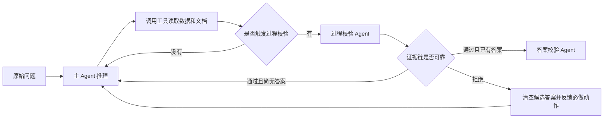
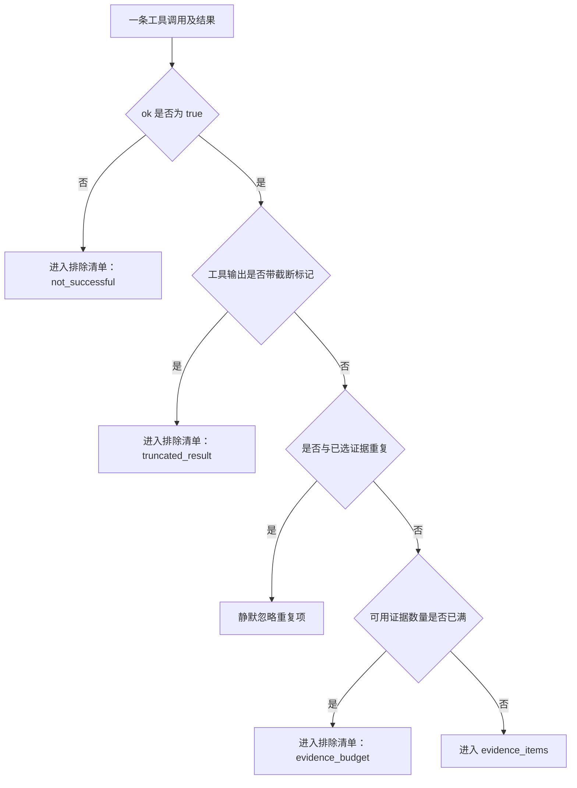

谢谢 一直都最喜欢你 我是爱 在你的心上
<!-- more -->

> 文档性质：当前实现说明与设计复盘
> 代码核对日期：2026-08-01
> 适用范围：仓库当前 LangGraph 主流程中的 Process Validator、证据包、语义账本与校验回环

## 技术摘要

过程校验 Agent 是主 Data Agent 求解过程中的“证据审计员”。

它不重新做一遍题，也不负责调整最终表格格式。它只回答一个问题：

> 主 Agent 当前选择的数据源、字段含义、关联关系、统计口径和候选结论，是否真的得到了来源证据支持？

它位于主 Agent 与答案校验 Agent 之间，同时也会在长任务执行途中按周期提前介入：




整套设计可以概括为五步：

1. 主 Agent 调用工具，运行时保存每一步的调用参数和结果。
2. 路由器在周期检查点或候选答案产生后触发过程校验。
3. 运行时从历史步骤中构造一个“证据包”，明确区分可用证据与排除项。
4. 过程校验模型检查数据源、字段语义、记录粒度、关联、指标、单位、时间范围和证据闭环。
5. 通过则继续；拒绝则把具体问题和下一步取证动作反馈给主 Agent。

## 先认识四个核心对象

理解过程校验前，需要先区分“运行轨迹”“证据包”“校验请求”和“语义账本”。

### 运行轨迹：主 Agent 实际做过什么

主 Agent 每执行一个模型步骤或工具步骤，都会在 `steps` 中追加一条记录。例如：

```json
{
  "step_index": 12,
  "node": "tool",
  "tool_calls": [
    {
      "id": "query_1",
      "name": "execute_probe_query",
      "args": {"queries": ["SELECT ..."]}
    }
  ],
  "tool_results": [
    {
      "ok": true,
      "tool": "execute_probe_query",
      "content": {"columns": ["company"], "rows": [["A"]]}
    }
  ]
}
```

运行轨迹是原始材料。它既包含成功结果，也可能包含失败、截断和重复结果，因此不能整体当成可靠证据。

### 证据包：从运行轨迹中筛出的审计材料

触发过程校验时，运行时会调用 `_build_supporting_source_evidence`，从完整工具轨迹中构造一个临时 JSON 对象：

```json
{
  "schema_version": 2,
  "evidence_items": [],
  "omitted_or_unusable": []
}
```

这个对象就是本文所说的“证据包”。它不是磁盘上的独立文档，也不是最终提交结果，而是被嵌入校验提示词、发送给过程校验模型的一段结构化上下文。

其中两个列表的含义是：

| 字段                    | 中文解释     | 能否证明事实                                 |
| ----------------------- | ------------ | -------------------------------------------- |
| `evidence_items`      | 可用证据列表 | 可以，校验器可以引用其中的来源事实           |
| `omitted_or_unusable` | 排除清单     | 不可以，只用于说明哪些结果没有被采纳以及原因 |


### 校验请求：真正发送给过程校验模型的内容

证据包只是校验请求的一部分。校验请求会把证据包、任务目标、候选答案及必要的诊断上下文一并发送给过程校验模型；各部分的来源、边界和作用见下文“阶段四：组装完整校验请求”。

前三个对象的关系是：


### 语义账本：跨校验轮次传递的记忆

语义账本记录了跨校验轮次积累的已验证结论、未验证假设和漂移风险。

与前三者不同，**语义账本是过程校验 Agent 独享的私有状态**。主 Agent 看不到这份账本，它收到的只有校验拒绝时抽取的“具体问题（`issues`）”和“必做动作（`required_next_actions`）”。这种信息隔离确保了主 Agent 只能根据明确的反馈去执行真实取证动作，而不会被校验器的内部推理想象直接带偏。

例如，某题要求统计指定年度内满足条件的来源记录。第一轮周期校验发现主 Agent 已确认目标表和时间字段，但尚未确认 `metric_rate` 是小数还是百分比；过程校验器会返回类似下面的账本：

```json
{
  "intent_summary": "统计指定年度内满足条件的来源记录",
  "verified_claims": [
    "目标记录来自 batch_records 表",
    "recorded_at 是任务要求的时间字段"
  ],
  "unverified_assumptions": [
    "metric_rate 的存储尺度尚未确认"
  ],
  "unresolved_ambiguities": [
    "阈值 5% 应与 0.05 还是 5 比较"
  ],
  "drift_risks": [
    "不要改用粒度不同的 summary_table"
  ]
}
```

这一轮会因未验证假设而被拒绝；主 Agent 实际只收到“读取 `metric_rate` 字段定义，并查询非空样例值确认存储尺度”这一必做动作。它完成取证后，下一轮过程校验会把上面的账本连同新增证据一起读取，并将已证实的尺度从 `unverified_assumptions` 移入 `verified_claims`，再判断是否可以通过。

## 为什么需要独立的过程校验

数据任务的关键错误通常发生在答案形成之前：

- 使用了名字相似但实际粒度不同的表；
- 根据字段名猜含义，没有查看定义或样例；
- Join 能运行，但没有证明两侧字段代表同一类实体；
- 查询结果行数合理、格式整齐，就默认计算路径正确。

答案校验主要关注最终答案是否按题意提交。它无法替代对整条取证过程的审计。因此项目把两者拆成两个职责明确的节点：

| 角色           | 核心问题                         | 负责检查                                                                   | 明确不负责                                |
| -------------- | -------------------------------- | -------------------------------------------------------------------------- | ----------------------------------------- |
| 过程校验 Agent | 为什么相信当前路径和结论？       | 数据源、字段语义、实体绑定、记录粒度、Join、指标、单位、时间范围、证据覆盖 | 最终列选择、行整形、去重、JSON 和表格格式 |
| 答案校验 Agent | 这份候选答案是否按题意正确提交？ | 最终范围、行列选择、去重和提交结构                                         | 重新建立完整来源证据链                    |

因此，过程校验 Agent 不应因为日期显示、百分比渲染、列表或字典编码、最终表格形状而拒绝答案。

## 阶段一：初始化过程校验状态

每个任务开始时会建立四个与过程校验直接相关的状态：

```text
process_validation_retry_count = 0
last_process_validated_model_count = 0
process_validation_passed = false
semantic_ledger = null
```

| 状态                                   | 作用                                   |
| -------------------------------------- | -------------------------------------- |
| `process_validation_retry_count`     | 记录过程校验已经拒绝过多少次           |
| `last_process_validated_model_count` | 记录上一次检查时主模型执行到了第几步   |
| `process_validation_passed`          | 记录当前任务是否已经通过过一次过程校验 |
| `semantic_ledger`                    | 保存跨校验轮次延续的语义结论和风险     |

过程校验是 LangGraph 中的 `validate_process` 节点。它使用主流程已有的聊天模型，但换成专门的 system prompt，要求模型只做语义和证据审计。

## 阶段二：判断什么时候触发

当前实现有两种正常触发方式。

### 触发方式一：周期检查

每次工具步骤结束后，路由器计算：

$$
\Delta s=
\text{step\_count}
-
\text{last\_process\_validated\_model\_count}
$$

当：

$$
\Delta s \ge \text{checkpoint\_model\_interval}
$$


这里的 `step_count` 是主模型调用次数，不是 LangGraph 所有节点的总数。

周期检查发生时可以还没有候选答案。校验器此时判断：

> 主 Agent 当前是否仍然沿着与原问题一致、并且由来源事实支持的路径前进？

这样可以在长任务中提前发现主 Agent 已经围绕错误数据源连续工作了很多步，而不是等到最终提交才发现。

### 触发方式二：候选答案检查

当主 Agent 通过 `submit_tool_result` 产生候选答案后，只要过程校验已启用且此前没有通过，就会先进入过程校验，再进入答案校验。


此时校验器判断：

> 这份候选答案依赖的来源事实和语义解释，是否足以支持提交？

### 哪些情况会跳过

以下情况不会实际调用过程校验模型：

- 任务已经出现终止性失败；
- 此前已经通过过程校验；
- 拒绝次数已经超过整改复查预算；
- 主流程已经进入强制答案收尾路径。

当前实现中，`process_validation_passed` 是任务级锁存状态。一次通过后，即使主 Agent 后面又执行了新工具步骤，也不会自动重新触发过程校验。这是因为一旦过程校验通过，就意味着当前路径的**核心语义已经锁定**。此后即使进入答案校验 Agent 且结果被拒绝，答案校验 Agent 也仅限于打回并指导主 Agent 修复格式、列名或行整形等问题，绝不会让主 Agent 去推翻或更改已经锁定的底层语义。

## 阶段三：从工具轨迹构造证据包

这是整个设计中最容易混淆、也最关键的一步。

### 第一步：从最近的工具结果向前扫描

证据构造器从完整 `steps` 的末尾向前遍历，只处理 `node="tool"` 的步骤。

这样做可以优先保留离当前决策最近的工具观察。完成选择后，代码会把选中的证据重新翻转回正常时间顺序，便于校验器阅读。

### 第二步：逐条决定进入哪个列表

每条工具结果按下列顺序处理：



最终只有三类排除原因：

| `reason`           | 含义                         | 为什么不能当作证据                         |
| -------------------- | ---------------------------- | ------------------------------------------ |
| `not_successful`   | 工具执行失败或没有成功完成   | 没有得到可信的来源观察                     |
| `truncated_result` | 工具保存的结果已经被截断     | 只能看到部分内容，不能证明完整范围         |
| `evidence_budget`  | 可用证据条数已经达到配置上限 | 不是结果本身错误，而是本轮校验上下文装不下 |

重复结果不会进入 `evidence_items`，也不会进入 `omitted_or_unusable`；代码直接跳过它，避免同一次查询反复占用证据预算。

### `evidence_items` 到底是什么

`evidence_items` 中的每一项都代表一次可以被校验器引用的成功工具观察：

```json
{
  "id": "step_12:call_query_1",
  "trace_step_index": 12,
  "tool_call_id": "query_1",
  "tool": "execute_probe_query",
  "capabilities": ["source_row_observation"],
  "source": {"kind": "tool_result", "name": "execute_probe_query"},
  "request": {"queries": ["SELECT company FROM source_table"]},
  "observation": {
    "status": "complete",
    "truncated": false,
    "locator": {"kind": "tool_result", "name": "execute_probe_query"},
    "evidence_excerpt": {
      "columns": ["company"],
      "rows": [["A"], ["B"]]
    }
  }
}
```

各字段回答了不同问题：

| 字段             | 回答的问题                               |
| ---------------- | ---------------------------------------- |
| `id`           | 这条证据如何与运行轨迹中的工具调用对应？ |
| `tool`         | 证据由哪个工具产生？                     |
| `capabilities` | 它能证明哪一类事实？                     |
| `source`       | 事实来自哪个文档、图片、表或工具结果？   |
| `request`      | 主 Agent 当时具体查询或读取了什么？      |
| `observation`  | 工具实际返回了什么？                     |

### `omitted_or_unusable` 是什么

`omitted_or_unusable` 可以直接理解为“排除清单”。它记录哪些工具结果没有被放进可用证据列表，以及排除原因。

例如主 Agent 做过三次工具调用：

1. 成功读取 `knowledge.md`；
2. 查询数据库时 SQL 报错；
3. 一次读取返回内容过长，被工具层截断。

证据包可能是：

```json
{
  "schema_version": 2,
  "evidence_items": [
    {
      "id": "step_3:call_doc",
      "tool": "read_doc",
      "source": {"kind": "document", "path": "knowledge.md"},
      "observation": {
        "status": "complete",
        "truncated": false,
        "evidence_excerpt": "metric_rate 以小数存储"
      }
    }
  ],
  "omitted_or_unusable": [
    {
      "tool": "execute_probe_query",
      "source": "execute_probe_query",
      "reason": "not_successful"
    },
    {
      "tool": "read_doc",
      "source": "large_report.md",
      "reason": "truncated_result"
    }
  ]
}
```

这段 JSON 的含义是：

- 校验器可以把 `knowledge.md` 中的字段定义当作正向证据；
- 校验器知道数据库查询失败过，但不能把失败查询当作数据事实；
- 校验器知道大文档只读取了部分内容，不能假装它已经完整覆盖；
- 排除项不会自动导致 `valid=false`，只有当缺少的材料正好是当前结论所必需的证据时，校验器才应拒绝；
- 排除清单不是备用证据，也不会被主 Agent 作为答案提交。

### 证据能力标签

每条可用证据会根据工具类型标记能力：

| 工具                        | 证据能力       | 能直接证明什么                     |
| --------------------------- | -------------- | ---------------------------------- |
| `get_table_profile`       | 表结构         | 表有哪些字段和基础结构             |
| `get_field_profile`       | 字段定义       | 字段类型、含义或分布               |
| `get_table_relationships` | 候选关联关系   | 可能存在的 Join 路径，但仍需验证   |
| `execute_probe_query`     | 来源行观察     | SQL 实际返回的行和值               |
| `execute_python`          | 程序化观察     | 代码实际计算出的中间结果           |
| `read_doc`                | 文档事实       | 文档中的定义与内容                 |
| `inspect_doc_structure`   | 文档结构       | 文档字段、主键和覆盖情况           |
| `extract_structured_doc`  | 结构化文档记录 | 从文档提取出的结构化行             |
| `read_context_image`      | 视觉事实       | 主 Agent 实际读取过对应图片        |
| `record_visual_evidence`  | 视觉观察回执   | 主 Agent 对图片采用了什么观察      |
| `search_semantic_catalog` | 来源发现       | 找到了候选来源，但不等于已验证内容 |

能力标签用于防止把“找到一个可能相关的数据源”误当成“已经读取并证明了其中的具体事实”。

## 阶段四：组装完整校验请求

证据包构造完成后，运行时将下列内容组装为一条 HumanMessage。它既提供正向来源证据，也保留用于复现、诊断和跨轮次衔接的上下文。

| 组成               | 包含内容                                                                                  | 在校验中的作用与边界                                                                                                                                               |
| ------------------ | ----------------------------------------------------------------------------------------- | ------------------------------------------------------------------------------------------------------------------------------------------------------------------ |
| 任务目标           | 原始问题                                                                                  | 固定对象、指标、时间范围、筛选条件与记录层级。                                                                                                                     |
| 候选答案与提交来源 | 列名、总行数和总列数、前五行预览、单值答案的标量值；产生答案的 SQL、Python 代码和工具参数 | 说明“提交了什么、由什么产生”，让校验器能沿提交来源回查证据。前五行仅用于复现检查，不代表真实答案只有五行；可复现的零也是合法结果。                               |
| 正向证据           | `evidence_items` 与 `knowledge.md`                                                    | 前者是允许证明过去工具事实的成功观察；后者是表结构、字段含义、单位、Join、指标及问题映射的权威来源。字段名直觉与知识文档冲突时，以知识文档为准。                   |
| 视频与视觉证据     | 视频导航摘要与视觉证据策略                                                                | 视频摘要只用于定位；视觉结论必须回到原始时间线、稳定帧，并在严格模式下记录观察回执。                                                                               |
| 排除项             | `omitted_or_unusable`                                                                   | 只说明未采纳的结果及原因，不能证明事实。                                                                                                                           |
| 跨轮次状态         | 上一轮语义账本：已验证结论、未验证假设与漂移风险                                          | 保留可继续使用的语义结论和仍需处理的风险，但不能替代真实来源证据。                                                                                                 |
| 诊断上下文         | 最近`recent_step_limit` 个步骤的压缩轨迹                                                | 工具步骤保留名称、参数、状态、错误和证据引用；模型步骤只保留结束原因、调用工具名和内容预览，不发送完整隐藏推理。它用于发现失败、重复和方向漂移，不是正向来源证据。 |

## 阶段五：过程校验 Agent 检查什么

过程校验模型审计的是“当前路径和候选结论是否有足够的语义证据”，而非重新做题或整理最终表格。

| 审计维度             | 要确认的事实                                                                                            | 典型风险                                                                                           |
| -------------------- | ------------------------------------------------------------------------------------------------------- | -------------------------------------------------------------------------------------------------- |
| 任务一致性           | 对象、指标、时间范围、筛选条件及实体/记录层级仍与原始问题一致。                                         | 回答了相似问题，或把实体集合误当成来源记录集合。                                                   |
| 来源与字段语义       | 数据源、字段定义和重要映射有 Schema、知识文档、成功工具观察或已验证账本支持。                           | 根据表名或字段名猜含义；行业常识、模型记忆、合理行数都不能替代来源证据。                           |
| 粒度、关联与计算口径 | Join 两侧代表同类实体且不意外改变粒度；指标口径、单位、百分比尺度和时间边界都有依据。                   | 错误合并记录、过早丢失来源记录身份，或误读比例、金额和日期。没有文档依据时，不能凭空要求一个主键。 |
| 候选答案的复现链     | 候选答案可沿“提交 SQL/Python →`evidence_items` 成功观察 → 数据源与字段定义 → 原始问题”反向核对。 | 把工具展示上限当作真实基数。大结果集应使用提交行数、`COUNT`、边界探查或未截断的验证查询复现。    |

它检查的是来源记录层面的粒度损失，不决定最终展示列、表格整形、交付去重、日期或百分比的显示形式，以及 JSON/list/dict 的编码差异；这些属于答案校验 Agent。

## 阶段六：输出什么

过程校验模型被要求只返回一个语义账本：

```json
{
  "valid": false,
  "issues": [
    "metric_rate 的单位尚未得到知识文档或数据探查支持"
  ],
  "required_next_actions": [
    "读取 metric_rate 的字段定义，并查询非空样例值确认存储尺度"
  ],
  "semantic_ledger": {
    "intent_summary": "统计指定年度内满足条件的来源记录",
    "verified_claims": [
      "目标记录来自 batch_records 表"
    ],
    "unverified_assumptions": [
      "metric_rate 的单位尚未确认"
    ],
    "drift_risks": [
      "不要改用粒度不同的 summary_table"
    ]
  }
}
```

| 字段                      | 作用                                 |
| ------------------------- | ------------------------------------ |
| `valid`                 | 当前路径或候选答案是否通过           |
| `issues`                | 阻塞当前路径的具体语义或证据问题     |
| `required_next_actions` | 主 Agent 下一步必须完成的取证动作    |
| `semantic_ledger`       | 保存已验证结论、未验证假设和漂移风险 |

解析器只强制要求响应是 JSON 对象并含有 `valid`。`issues` 和 `required_next_actions` 缺失时按空列表处理；账本格式不正确时保留上一轮账本。

## 阶段七：通过、拒绝和异常后如何流转

通过时，`process_validation_passed` 会被锁存，新的语义账本与最近校验步数被保存；没有候选答案就继续主 Agent，有候选答案才进入答案校验。

拒绝时，运行时清空候选答案及其提交来源，把 `issues` 和 `required_next_actions` 反馈给主 Agent；后者是下一次提交前必须完成的取证任务，而非普通建议。

技术异常一律记录为 `validator_error` 后放行，保证任务能结束，但可能漏过真实的语义错误。


## 当前配置画像

过程校验行为由运行时选择的 YAML 决定。

| 配置                    | 是否启用 | 周期检查间隔 | 整改复查预算 | 近期轨迹 | 可用证据上限 | 字符串摘要上限 | 列表摘要上限 |
| ----------------------- | -------- | -----------: | -----------: | -------: | -----------: | -------------: | -----------: |
| `configs/docker.yaml` | 是       |  12 个模型步 |            1 |   200 步 |          100 |   10000 tokens |          200 |

## 结论

当前过程校验 Agent 不是“再找一个模型重新做题”，而是一层插入主求解图的证据治理机制：

```text
主 Agent 调用工具
  → 保存完整运行轨迹
  → 筛选可用证据与排除项
  → 组装校验请求
  → 审计数据源、语义、粒度和复现链路
  → 通过后继续，拒绝后携带必做动作回环
```

它的核心价值，是让系统不仅保存“最后提交了什么”，还能够回答：

> 这份答案依赖哪些来源？哪些工具结果可以作为证据？哪些结果被排除了，为什么排除？关键解释由什么事实支持？证据不足时，主 Agent又被要求补做了什么？

对外描述时应始终保持三个边界：过程校验审计的是语义证据链，不负责最终输出整形；过程校验通过不等价于 benchmark 答案必然正确；校验器技术故障时当前实现会选择放行。
