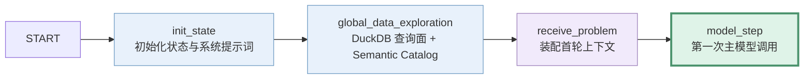

<!-- more -->

> 文档性质：当前实现说明与产物索引
> 代码核对日期：2026-07-31
> 适用范围：仓库当前的任务选择、上下文规范化、PDF 文本化、视频材料转换、CSV/JSON/SQLite 的 DuckDB 统一查询面、全局数据巡检、Semantic Catalog 构建与首轮上下文装配

## 技术摘要

主 Agent 并不是拿到原始任务后立刻开始推理。在它第一次进入 `model_step` 之前，系统已经先完成了一条独立的预处理链路：

1. 从数据集中选择本次要执行的任务，跳过已有结果并建立输出目录。
2. 扫描任务上下文，把普通文件、PDF 和视频统一组织为 `ContextView`。
3. 将 PDF 转成 Markdown；遇到视频时，调用已有的视频预处理与视频理解流程生成导航材料。
4. 初始化 Agent 状态、系统提示词、步骤计数器和运行追踪容器。
5. 识别 CSV、JSON、SQLite 等异构结构化数据，并映射成统一的 DuckDB 内存逻辑表。
6. 用 DuckDB 的实际查询类型校准字段，推断关系并验证派生语义视图。
7. 生成完整 Semantic Catalog，再投影出主 Agent 首轮使用的轻量 Catalog。
8. 把用户问题、轻量 Catalog 和视频摘要等内容装配成首个 `HumanMessage`。
9. 至此才进入 `model_step`，主 Agent 开始实际推理和工具调用。


## 为什么不能把原始任务直接交给主 Agent

一个 KDD Cup 任务的上下文可能同时包含：

- CSV、JSON、SQLite 等结构化数据；
- `knowledge.md` 和其他说明文档；
- PDF；
- 图片；
- 屏幕录制视频；
- 多张表之间尚未显式声明的关系。

如果直接把这些文件名交给模型，主 Agent 的前几轮通常要重复完成“有哪些文件、哪些能查询、PDF 里有什么、视频该怎么看、表之间是否可能关联”等准备工作。这会带来三个问题：

1. **工具选择成本高**：模型还不知道合适的数据入口，就开始试探式调用工具。
2. **上下文格式不统一**：PDF、视频和结构化表需要完全不同的读取方式。
3. **结果难以复查**：如果准备过程只存在于模型思考中，就很难解释它为何选择某张表或忽略某份材料。

因此，我们先用确定性代码把原始材料规范化，将异构结构化文件统一暴露为 DuckDB 查询面，再生成一份可查询的数据地图，最后才让主 Agent 开始求解。

## 阶段一：运行级任务准备

`run_benchmark` 首先建立运行目录并读取数据集，然后按运行参数确定本次真正执行的任务：

| 规则               | 作用                                            |
| ------------------ | ----------------------------------------------- |
| `task_ids`       | 只选择配置或调用方指定的任务                    |
| `skip_completed` | 已存在有效`prediction.csv` 的任务不再重复执行 |
| `max_workers`    | 控制任务级并发数                                |

这一阶段的主要产物不是数据文件，而是：

- 本次运行的任务列表；
- 被跳过的任务列表；
- run 级输出目录；
- 每个任务自己的输出目录。

随后每个任务进入 `_prepare_task_for_run`，开始真正的上下文预处理。

## 阶段二：构造隔离的 ContextView

### 核心设计

预处理不会把 PDF 转写结果、视频截图等文件写回原始任务目录，而是在任务输出目录下建立 `generated_context`。随后用 `ContextView` 把“原始文件”和“本次生成文件”组合成一个统一视图。

> `ContextView` 统一的是 Agent 使用资源的逻辑路径。


三层边界分别是：

```text
原始上下文
  只读事实来源，不因预处理而改写

generated_context
  本次运行生成、可供 Agent 消费的派生材料

ContextView
  用统一可见路径描述原始材料和派生材料
```

### 普通文件如何处理

普通文件不会被复制或改写。系统只为它们建立 `ContextAsset` 记录：

```text
source_path    原始上下文中的来源路径
visible_path   Agent 和工具使用的相对路径
physical_path  文件在磁盘上的真实路径
action         source
generated      false
```

这意味着 CSV、JSON、SQLite、Markdown、图片等文件仍然直接指向原始事实来源，但后续模块不必自行拼接路径。

示例：

```
"source_path": "doc/lc_ipodeclaration.md",
"visible_path": "doc/lc_ipodeclaration.md",
"physical_path": "C:\\Users\\ulna\\Desktop\\kddcup\\kddcup2026-data-agents-starter-kit\\data\\input\\task_1\\context\\doc\\lc_ipodeclaration.md",
"action": "source",
"generated": false
```

### PDF 如何处理

PDF 会在主 Agent 运行前被转换成 Markdown：

1. 用 PyMuPDF 打开文档。
2. 提取页面文本行。
3. 优先使用 PDF 目录识别标题；没有目录时按版面特征组织文本块。
4. 合并被分页或换行切断的自然段。
5. 在 `generated_context` 中写出同名 `.md`。

对应资产会被标记为：

```text
action: pdf_to_markdown
generated: true
```

它解决的是“让文本搜索和文档读取工具能够消费 PDF 内容”，并不承诺保留复杂表格、图片和原始版式的全部视觉语义。

示例：

```
"source_path": "doc/lc_issueandlistagent.pdf",
"visible_path": "doc/lc_issueandlistagent.md",
"physical_path": "C:\\Users\\ulna\\Desktop\\kddcup\\kddcup2026-data-agents-starter-kit\\artifacts\\runs\\20260618T082933Z\\task_1\\generated_context\\doc\\lc_issueandlistagent.md",
"action": "pdf_to_markdown",
"generated": true
```

### 视频如何处理

当上下文中出现受支持的视频时，系统会生成：

- 带时间戳的语音转写；
- 稳定画面；
- 图文时间线；
- 视频理解导航摘要；
- 视频预处理 manifest 和调试副本。

主 Agent 初始上下文优先使用导航摘要；需要核对视觉事实时，仍可沿摘要中的路径读取时间线和原始稳定帧。

视频内部的采样、差分、稳定区间、ASR 对齐和摘要规则不在本文重复展开，详见：

[KDD Cup 2026 Data Agent：IDMG123 队伍视频理解方案](video-understanding-pipeline.md)

### ContextView 最终产物

完成扫描后，系统会得到一个按 `visible_path` 排序的资产集合。无论文件来自原始目录还是生成目录，后续的数据巡检和主 Agent 都通过同一个接口访问。

同时写出：

```text
context_preprocessing_manifest.json
```

其中每一项至少记录：

| 字段              | 含义                                                           |
| ----------------- | -------------------------------------------------------------- |
| `source_path`   | 原始材料相对路径                                               |
| `visible_path`  | Agent 实际看到的路径                                           |
| `physical_path` | 当前运行中对应的真实磁盘路径                                   |
| `action`        | `source`、`pdf_to_markdown`、`video_timeline` 等处理动作 |
| `generated`     | 是否为本次预处理生成                                           |

因此可以从任意派生文件反查它来自哪个源文件、经过了什么处理。

## 阶段三：初始化 Agent 运行状态

上下文准备完成后，Runner 创建 `LangGraphAgent`。图的第一个节点是 `init_state`，它负责建立一个干净、可追踪的运行状态。

当前会初始化：

- 系统提示词；
- 主模型步数；
- 各类检查重试计数；
- 答案与结构化提交占位；
- 语义证据账本占位；
- 步骤记录和工具事件；
- 数据巡检结果占位；

这一步不读取业务数据，也不调用主模型。它的作用类似创建一张空白但字段齐全的运行表单，让后续每次模型调用、工具调用和状态变化都能落在明确位置。

## 阶段四：全局数据巡检

 `global_data_exploration` 会在主 Agent 第一次调用模型之前扫描整个 `ContextView`。这不是让另一个模型提前回答问题，而是用程序化检查建立数据目录。

### 第一步：资产识别

系统遍历所有可见资产，记录：

- 可见路径；
- 文件类型；
- 文件大小；
- 推荐读取工具。

对 CSV、JSON、SQLite 和文档，还会在配置的采样预算内进一步提取结构信息。无法解析的资产不会让整个流程中止，而是进入 `semantic_uncertainties`，明确告诉后续流程“这份材料没有被可靠扫描”。

### 第二步：结构画像

不同类型的数据会形成相应画像：

- CSV：列名、推断类型、采样值等；
- JSON：可查询结构和字段信息；
- SQLite：表、列、类型以及可用的数据库关系；
- 文档：标题结构、预览文本和知识内容；
- 图片：作为媒体路径登记；
- PDF：此时扫描的是前一阶段生成的 Markdown；
- 视频：此时扫描的是前一阶段生成的时间线、摘要和稳定帧。

## 阶段五：DuckDB 统一结构化查询层

全局巡检并不止于“读取 CSV 表头、解析 JSON 字段”。它会把 CSV、JSON 和 SQLite 映射到同一个 DuckDB SQL 命名空间，使主 Agent 后续不必分别学习三套读取接口。

### 支持范围与注册方式

| 原始数据           | 当前识别后缀                       | DuckDB 中的注册方式                                                                |
| ------------------ | ---------------------------------- | ---------------------------------------------------------------------------------- |
| CSV                | `.csv`                           | `read_csv_auto()` 创建 View；表名默认取文件 stem                                 |
| JSON               | `.json`                          | `read_json_auto()` 创建 View                                                     |
| SQLite             | `.db`、`.sqlite`、`.sqlite3` | 以只读方式读取源表，经 DataFrame 注册为 DuckDB View                                |
| 文档结构化抽取结果 | 系统生成的 JSONL                   | 在主 Agent 调用`extract_structured_doc` 后注册；它不是开工前已有的原始输入查询面 |

这里的“注册”不是把所有数据复制进一个持久化数据库。当前实现每次创建：

```python
duckdb.connect(":memory:")
```

也就是任务内临时的内存 DuckDB 连接：

- 原始 CSV、JSON、SQLite 不会被移动或改写；
- CSV 和 JSON 由 DuckDB 直接读取并建立逻辑 View；
- SQLite 始终只读，运行查询时只注册 SQL 实际引用或派生 View 依赖的表；
- 连接关闭后不会留下 `.duckdb` 实体文件；
- schema 巡检和后续工具查询会分别创建连接，并按同一份 Catalog 重建一致的逻辑表。

因此，更准确的架构表述是：

> 系统把异构结构化文件统一映射为可重建的 DuckDB 内存逻辑查询层，而不是提前导入一个持久化 DuckDB 数据库。


### DuckDB 类型校准

格式扫描器先获得源字段和推断类型，随后系统在临时 DuckDB 中实际注册逻辑表并执行 `DESCRIBE`。得到的 DuckDB 列类型会回填到完整 Catalog，从而让：

- 首轮 `query_surfaces` 中的字段类型；
- `get_table_profile` 返回的类型；
- `execute_probe_query` 的运行时类型

保持一致。若某个资产无法注册或无法检查 schema，系统会把风险写入 `semantic_uncertainties`，而不是伪装成可正常查询的表。

### 关系推断、Semantic View 与查询表面

系统根据表结构和字段证据推断候选关系，并尝试建立派生查询视图。候选视图必须通过配置中的置信度、匹配率、唯一性和实际查询校验，才会保留在目录中。

当前 `configs/docker.yaml` 的主要限制为：

| 配置                            |   当前值 | 作用                                 |
| ------------------------------- | -------: | ------------------------------------ |
| `min_confidence`              | `0.95` | 候选关系的最低置信度                 |
| `min_distinct_match_ratio`    | `0.90` | 不同值匹配比例下限                   |
| `strict_distinct_match_ratio` | `0.95` | 严格匹配场景下限                     |
| `min_target_uniqueness_ratio` |  `1.0` | 目标键必须保持唯一                   |
| `max_views`                   |   `30` | 最多保留的派生视图数                 |
| `allow_one_to_one_enrichment` | `true` | 允许一对一关系形成补充字段的派生视图 |

派生视图会在 DuckDB 中实际创建并校验。只有 SQL 能成功执行，且 View 行数与基础表完全一致时才会保留。它是查询便利层，不是新的事实来源，也不会自动替业务问题执行筛选、聚合、去重、最新记录选择或单位换算。

## 阶段六：生成两层 Semantic Catalog

一次全局巡检会产生两种粒度不同的目录。


### 完整 Semantic Catalog

完整目录保存：

```text
assets
schemas
relationships
derived_views
relationship_warnings
query_relevance
semantic_uncertainties
```

它保留字段画像、关系证据和视图校验信息，适合后续工具按需查询，而不适合整体塞入主 Agent 首轮上下文。

完整目录被写入 ：

```text
inspector.semantic_catalog
```

并缓存在工具运行上下文中。主 Agent 后续如果需要字段值域、Top 值、关系证据或完整结构，可以通过 Semantic Catalog 工具继续查询。

任务结束写出结果时，它还会保存为：

```text
semantic_catalog.json
```

### 轻量 Catalog

系统从完整目录投影出一份首轮地图，只保留：

| 部分                       | 内容                                     |
| -------------------------- | ---------------------------------------- |
| `query_surfaces`         | 建议优先查询的原始表或通过校验的派生视图 |
| `documents`              | 普通知识文档的路径、标题和推荐工具       |
| `media`                  | 图片等媒体资产路径                       |
| `knowledge_documents`    | `knowledge.md` 的限量内容              |
| `semantic_uncertainties` | 扫描阶段未能消除的风险                   |

轻量目录的目标不是替主 Agent 做数据分析，而是让它第一轮就知道：

- 有哪些可靠的查询入口；
- 每个入口来自原始表还是派生视图；
- 文档和媒体放在哪里；
- 哪些材料还需要主动验证。

轻量目录以 JSON 文本形式保存到：

```text
global_data_profile
```

任务结束时通常还会写出：

```text
global_data_profile.json
```

如果全局巡检发生异常，节点会记录失败信息并继续执行，而不是让整个任务在主 Agent 启动前直接终止。

## 阶段七：装配主 Agent 的首轮输入

`receive_problem` 是主 Agent 第一次调用模型前的最后一个节点。它把此前的材料组织成一个 `HumanMessage`。

当前首轮文本主要由三部分组成：

```text
<user_query>
  原始用户问题
</user_query>

<context_injection>
  轻量 Catalog
  目录及其使用说明
</context_injection>

<action_trigger>
  根据目录选择合适入口并调用工具开始求解
</action_trigger>
```

如果任务包含视频，`build_initial_user_content` 会继续附加视频材料：

1. 如果视频理解摘要存在，优先加入摘要文本和证据定位说明。
2. 如果没有摘要但有时间线，则加入时间线以及稳定帧路径。

## 主 Agent 真正从哪里开始运行

当前图的前半段是：



`model_step` 才是本文所说的“主 Agent 开始实际工作”：

- 模型第一次看到完整的系统提示词和首轮用户消息；
- 产生第一段任务推理；
- 选择并调用第一个工具，或者在满足条件时提交答案。

因此，预处理并不占用 `max_steps` 中的主模型回合；视频理解摘要若触发，会产生独立的前置模型调用，但它不属于主 Agent 的 `model_step`。

## 最终产生了哪些产物

预处理产物分为三类：运行时对象、首轮上下文和磁盘文件。

### 运行时对象

| 产物                          | 消费方                   | 用途                           |
| ----------------------------- | ------------------------ | ------------------------------ |
| `ContextView`               | 数据巡检、工具、主 Agent | 统一访问原始与生成资产         |
| DuckDB 内存逻辑查询层         | 数据巡检、查询工具       | 统一查询 CSV、JSON、SQLite     |
| 完整 Semantic Catalog         | Semantic Catalog 工具    | 按需查询字段、关系和视图证据   |
| 轻量 Catalog                  | 主 Agent 首轮消息        | 快速选择查询入口               |
| 初始化后的`AgentGraphState` | 整个 LangGraph           | 保存步骤、答案、事件和运行状态 |
| 首个`HumanMessage`          | `model_step`           | 主 Agent 的实际任务起点        |

### 任务输出目录

一个同时包含普通数据、PDF 和视频的任务，在预处理完成后可能形成：

```text
<task_output_dir>/
├── context_preprocessing_manifest.json
├── generated_context/
│   ├── manual.md
│   └── video/
│       ├── briefing_timeline.md
│       ├── briefing_video_summary.md
│       └── briefing_stable_frames/
│           └── stable_*.jpg
├── video_preprocessing/
│   └── briefing.mp4/
│       ├── timeline.md
│       ├── transcript.json
│       ├── video_preprocessing_manifest.json
│       └── stable_frames/
├── video_understanding/
│   └── ...
├── semantic_catalog.json
├── global_data_profile.json
└── trace.json
```

需要区分写出时机：

- `context_preprocessing_manifest.json`、`generated_context/` 和视频目录在主 Agent 启动前生成。
- 完整目录和轻量目录在主 Agent 启动前已存在于运行状态中。
- `semantic_catalog.json`、`global_data_profile.json` 和最终 `trace.json` 由 Runner 在任务结果落盘时写出。

因此，“Agent 开始前已经计算出来”和“Agent 开始前已经作为独立文件落盘”不是完全相同的概念。

## 当前配置画像

以当前 `configs/docker.yaml` 为准，与预处理最相关的配置是：

```yaml
agent:
  enable_data_inspector: true
  prompt_version: 3

data_inspector:
  sample_budget:
    catalog_top_distinct_values: 5
    max_doc_tokens: 1000
  semantic_views:
    enabled: true
    min_confidence: 0.95
    min_distinct_match_ratio: 0.90
    strict_distinct_match_ratio: 0.95
    min_target_uniqueness_ratio: 1.0
    max_views: 30
    allow_one_to_one_enrichment: true

video_preprocessing:
  enabled: true
  sample_fps: 2.0
  diff_threshold: 0.010
  max_attached_frames: 32
  asr_stage: dynamic-plus-ui
```

这里有三个重要边界：

1. `catalog_top_distinct_values` 是字段画像的采样上限，不代表表中只有这些不同值。
2. `max_doc_tokens` 限制首轮知识文本规模，不代表完整文档被删除；后续仍可用文档工具读取。
3. `max_attached_frames` 只约束主 Agent 的初始视频材料规模，不等于视频预处理只生成这些图片。

## 结论

当前的主 Agent 前置流程不是简单的“扫描一下文件”，而是一条分层的数据准备管线：

```text
任务调度
  + 原始/生成上下文隔离
  + PDF 与视频格式规范化
  + CSV / JSON / SQLite 异构数据识别
  + DuckDB 内存逻辑表统一注册
  + DuckDB 类型校准、关系推断与查询视图校验
  + 完整目录与轻量地图分层
  + 首轮消息装配
```

它最终让主 Agent 在第一次推理时已经拥有：

- 一个明确的问题；
- 一份统一的资产视图；
- 一套可以用统一 SQL 查询异构结构化数据的 DuckDB 逻辑表；
- 一张经过扫描的数据入口地图；
- 可按需深挖的完整语义目录；
- 已被压缩成可消费材料的 PDF 和视频；
- 一条能够回到原始来源的追溯路径。

这套设计的核心价值不是替主 Agent 提前求解，而是把“找材料、认格式、统一查询、校准类型、建目录、选入口”从不稳定的模型试探，转化为可重复、可检查、可追溯的准备工作。
