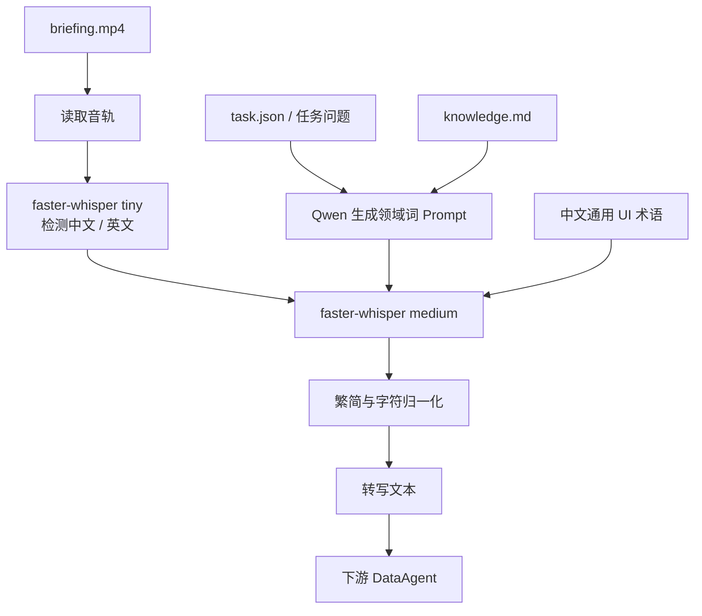

谢谢 一直都最喜欢你 我是星星 会永远守护着你

<!-- more -->

> 整理日期：2026-07-23
> 原始材料：小红书笔记《KDD Cup DataAgent Top1🥇方案分享(1)》及其 8 张配图
> 原文链接：[KDD Cup DataAgent Top1 方案分享（1）：视频理解 ASR 技术方案](http://xhslink.cn/o/lMS7TZJ4Kg)
> 适用范围：KDD Cup DataAgent briefing 视频的语音识别、方案复盘与工程参考
> 重要说明：本文整理的是 Top1 团队公开分享的 **ASR 子方案**，不是其完整 DataAgent 系统。

# 技术摘要

该方案处理比赛任务中附带的 `briefing.mp4`：先把视频旁白转写成带领域语义的文本，再交给下游 DataAgent 使用。作者认为这批视频的主要难点不是背景噪声，而是：

- 中文专业词和 UI 词的同音字选择；
- 中英文混合数据的语言路由；
- Whisper 大模型在音频末尾继续编造内容；
- 繁简体和标点差异对 CER/WER 评测口径的干扰。

最终方案没有直接使用最大的 Whisper，而是采用分工式流水线：

1. 用 `faster-whisper tiny` 快速检测语言；
2. 让 Qwen 根据任务问题和知识文档生成少量领域词；
3. 用 `faster-whisper medium` 按检测语言完成转写；
4. 通过 `initial_prompt` 软引导专业词和同音字；
5. 中文追加一段固定的通用 UI 术语；
6. 对输出与参考文本统一做繁简和字符归一化。

作者公开的最终结果为：

| 语言 |     最终指标 |
| ---- | -----------: |
| 中文 |  CER`1.9%` |
| 英文 | WER`0.75%` |

这些结果以 Azure Fast Transcription 输出作为参考文本，而不是人工逐字标注，因此应表述为“相对于 Azure 转写结果的 CER/WER”，不能直接解释为绝对真实准确率。

# 任务背景

部分 DataAgent 任务提供 briefing 视频，要求 Agent 根据视频中的讲解完成后续分析。旁白会描述当前 UI 状态、筛选方式、字段、路径和干扰项。

视频中的冗余内容较多，但关键位置可能包含：

- 正确的表名、字段名和页面路径；
- 数据选择条件；
- 口径边界；
- 哪些页面或记录只是示例；
- 哪些数据必须排除；
- 对干扰项的主动警告。

作者使用的测试集包括 30 段 briefing 视频：

| 项目     | 数量或特点           |
| -------- | -------------------- |
| 视频总数 | 30                   |
| 中文视频 | 20                   |
| 英文视频 | 10                   |
| 语音类型 | 旁白式 TTS 配音      |
| 音频环境 | 发音标准、基本无噪声 |

因此，方案目标不是面向通用会议录音的鲁棒 ASR，而是针对“干净 TTS + 数据平台专业词 + 自动化下游”的定向优化。

# 总体流程



可将其概括为：

```text
小模型做路由
+ 中型 ASR 模型做稳定转写
+ LLM 生成词汇偏置
+ 固定术语处理重复错误
+ 归一化保证评测和下游口径一致
```

# 决策一：语言检测使用 tiny

作者比较了从 `tiny` 到 `large-v3` 的五个 Whisper 模型。在 30 条测试音频上，五个模型的中英文检测结果全部正确，但耗时差异明显：

| 模型         | 检测耗时/条 | 测试集准确率 |
| ------------ | ----------: | -----------: |
| `tiny`     |  `0.14 s` |     `100%` |
| `base`     |  `0.27 s` |     `100%` |
| `small`    |  `0.93 s` |     `100%` |
| `medium`   |  `3.10 s` |     `100%` |
| `large-v3` |  `5.71 s` |     `100%` |

因此语言检测选择速度最快的 `tiny`。这里的 `100%` 只适用于这 30 条干净 TTS 样本，不能外推到噪声语音、口音或代码切换场景。

## 为什么不能统一指定中文

数据集中同时包含中文和英文。如果对所有音频强制设置 `language="zh"`，英文音频可能被转成大段中文幻觉。作者观察到某条英文音频在这种设置下错误率达到 `1.0`。

正确流程是：

```python
language = detect_language_with_tiny(audio)
result = transcribe_with_medium(
    audio,
    language=language,
)
```

语言检测不是最终识别任务，不需要为它支付 large-v3 的计算成本。

# 决策二：正式转写选择 medium

作者以 Azure Fast Transcription 输出作为参考文本，对四个模型的正文识别和末尾幻觉进行比较：

| 模型         |  中文 CER | 英文 WER | 末尾幻觉                   |
| ------------ | --------: | -------: | -------------------------- |
| `base`     | `10.4%` | `1.9%` | 无                         |
| `small`    |  `6.8%` | `1.3%` | 几乎无                     |
| `medium`   |  `3.2%` | `2.8%` | 极少：中文 1 条、英文 1 条 |
| `large-v3` |  `7.2%` | `8.7%` | 严重：中文 5 条、英文 2 条 |

## large-v3 的末尾幻觉

large-v3 的主要问题不是正文听写能力，而是音频正文结束后仍对着微弱尾音继续生成内容。公开示例包括：

- “请不吝点赞、订阅、转发、打赏……”等与任务无关的宣传语；
- 极端情况下生成 200 多字的中英文混杂内容。

如果人工删除幻觉部分，作者报告 large-v3 的正文结果约为：

| 语言 | 裁掉幻觉后的指标 |
| ---- | ---------------: |
| 中文 |      CER`3.5%` |
| 英文 |      WER`2.7%` |

这说明 large-v3 的正文识别并不差，但自动化系统不能依赖人工裁剪。末尾幻觉会污染下游 Agent 的条件判断，因此模型选择必须考虑端到端错误形态，而不只是理想正文的识别率。

## 为什么 medium 是更好的系统选择

medium 的综合优势是：

- 正文识别能力明显强于 base 和 small；
- 末尾幻觉显著少于 large-v3；
- 可以通过 Prompt 工程继续修复同音字；
- 无需额外构建不稳定的幻觉裁剪器。

作者最终将 medium 定义为“识别够好 + 幻觉够少”的最佳平衡点。

# 决策三：用 Prompt 解决同音字

medium 剩余的中文错误主要不是“没听到正确读音”，而是“听到了读音，但选择了错误文字”。公开示例包括：

| 正确词   | ASR 错误 |
| -------- | -------- |
| 字段     | 自断     |
| 送股     | 颂谷     |
| 任职绩效 | 认值计效 |
| 队列     | 对列     |

继续增大模型并不能稳定解决这类问题，因此作者使用 Whisper 的 `initial_prompt` 提供词汇软引导。

## Prompt 的信息来源

Qwen 读取两类输入：

- `task.json` 或任务问题：理解当前页面、业务目标、字段和路径；
- `knowledge.md`：确认领域术语的规范写法。

Qwen 不负责转写音频，只负责为 Whisper 生成少量高价值词汇。

## Prompt 生成规则

作者总结了三条核心规则：

1. **以任务问题为主要线索**。问题中的看板名、字段名、路径和业务对象最可能在旁白中出现。
2. **knowledge.md 只用于确认规范写法**。不把整个数据库字段列表复制进 Prompt，否则大量无关词会成为噪声。
3. **只保留 8～15 个正确标准词**。Prompt 应少而准，不应堆砌领域词库。

## 中文两段式 Prompt

中文 Prompt 由两部分组成：

- 前半段：Qwen 根据具体任务动态生成的业务术语；
- 后半段：固定追加的通用 UI 术语，用于兜底重复出现的同音字。

公开示例：

> 这是操作员在数据平台界面讲解，涉及公司档案信息、股票代码 600234、董秘姓名和董秘联系电话的查询与核对。界面常见术语包括字段、批次、配置、加载、面板、看板、卡片、队列、筛选、核对、列、路径。

其中：

- 公司档案、`600234`、董秘姓名等是动态业务词；
- 字段、配置、面板、队列和路径等是固定 UI 词。

作者报告，在 task 7 的“字段/队列”相关样本上，CER 从 `0.076` 降至 `0.027`。

# Prompt 优化结果

最终成绩图给出的优化轨迹为：

| 优化阶段              |   中文 CER |   英文 WER |
| --------------------- | ---------: | ---------: |
| medium，无 Prompt     | 约`3.5%` | 约`4.0%` |
| 加入 Qwen 动态 Prompt |   `2.8%` |  `0.75%` |
| 中文追加通用 UI 术语  |   `1.9%` | 未单独报告 |

作者据此得出：

- 英文主要依赖任务相关 Prompt，WER 最终降至 `0.75%`；
- 中文除动态业务词外，还需要固定 UI 术语兜底，CER 最终降至 `1.9%`。

# 三个容易忽略的工程细节

## 中文输出必须统一繁简

faster-whisper 可能输出繁体，而参考文本可能是简体。直接比较会把繁简差异错误计入 CER。

作者公开的示例中：

| 处理方式     | base 中文 CER |
| ------------ | ------------: |
| 未做繁简统一 |       `26%` |
| 繁简统一后   |      `9.5%` |

建议对模型输出和参考文本同时执行：

```python
from opencc import OpenCC

converter = OpenCC("t2s")
normalized_prediction = converter.convert(prediction)
normalized_reference = converter.convert(reference)
```

只转换其中一侧仍可能造成评测口径不一致。

## 不能强制设置 `language="zh"`

跨语言数据必须先检测语言，再把检测结果传给正式转写。强制中文可能把英文音频转成大段中文幻觉。

## VAD 不能根治末尾幻觉

作者测试 `vad_filter=True` 后，large-v3 的末尾幻觉没有消失。

原因是：

- VAD 擅长切除纯静音；
- 末尾幻觉往往发生在仍存在微弱声音或尾音的片段；
- 这些片段不会被 VAD 判定为纯静音。

因此 VAD 可以用于速度或静音清理，但不应被视为末尾幻觉的主要治理手段。

# 评测方法

## 参考文本

作者使用 Azure Fast Transcription 的输出作为 gold，理由是其中文质量较高并带词级时间戳。

这不是人工逐字标注，因此指标只能说明当前方案与 Azure 输出的接近程度。若 Azure 自身发生错误，该错误也会进入评测基线。

## 指标

- 中文：Character Error Rate，CER；
- 英文：Word Error Rate，WER。

标准编辑距离指标可写为：

```text
Error Rate = (Substitutions + Deletions + Insertions) / Reference Length
```

中文以字符为单位，英文以词为单位。

## 归一化

在计算指标前，作者执行：

- 繁体转简体；
- 只保留汉字、英文字母和数字；
- 去除标点以及不同标点形式造成的差异。

评测代码必须固定归一化规则，否则不同实验之间的 CER/WER 不可比较。

# 学习感悟

top1作者在原帖评论中提到：“采取的是贪心方案，将每个部分都尽力做到**最强**。”仅仅从语音检测ASR层面。就已经可以体现出top1对于每个模块的精益求精。相比之下，我们的语音ASR仅仅直接使用`faster-whisper base`进行语音转文字。除此之外没有再进行额外的阶段设计。也没有批量的进行识别效果验证。

虽然我自己并没有ASR相关知识，但是使用大模型，应该是可以针对这一模块再进行优化设计的，但是当时没有时间做。重点把精力放在了后续的长文档抽取功能上。
