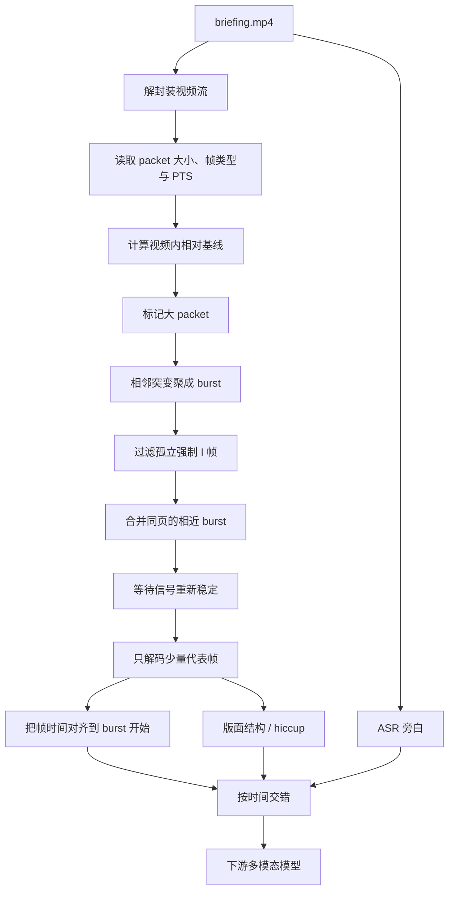

没关系 我在这里 我是春天 拥抱着你的天空

<!-- more -->

> 整理日期：2026-07-24  
> 原始材料：小红书笔记《KDD Cup DataAgent Top1 🥇 分享（2）》及其 6 张配图  
> 原文链接：[KDD Cup DataAgent Top1 方案分享（2）：基于 H.264 码流的关键帧抽取](http://xhslink.cn/o/438Ipd4Vymo)  
> 适用范围：KDD Cup DataAgent briefing 视频、PPT 式录屏、软件操作演示的关键帧抽取与多模态输入组织  
> 重要说明：本文整理的是 Top1 团队公开分享的**视频抽帧子方案**，不是其完整 DataAgent 系统，也不代表本仓库当前已经实现这些能力。  

# 技术摘要

比赛中的 briefing 视频大多是对操作界面、数据看板和筛选过程的讲解，视觉形态很像 PPT：

- 一个页面会稳定停留数秒；
- 页面之间存在明显切换；
- 页面内部可能出现少量动画、弹窗或元素飞入；
- 几千帧画面中，大多数帧高度重复。

常规做法是定时抽帧，例如每 2 秒抽取一张，再把所有图片交给视觉大模型。问题是：

- 静止页面会被重复抽取很多次；
- 很短的关键页面可能刚好落在采样间隔之间；
- 大量重复帧会增加视觉模型的输入长度和调用成本；
- 抽到转场中间帧时，文字、图表和页面结构可能尚未稳定。

作者没有先解码全部画面，而是读取 H.264 压缩码流中每个 packet 的大小，把它当作画面变化的廉价代理信号：

```text
小包连续出现
≈ 画面稳定

连续出现一簇大包
≈ 页面切换、动画或明显变化

安静区中孤立出现一个超大包
≈ 可能只是编码器周期性插入的 I 帧
```

最终流程是：

1. 用 packet 大小检测变化候选；
2. 把连续突变聚成 burst；
3. 过滤孤立的强制 I 帧；
4. 合并属于同一页面的相近 burst；
5. 在变化结束、画面稳定后解码一张代表帧；
6. 将代表帧、ASR 旁白和版面结构按时间交错，交给下游多模态模型。

一句话概括：

> 先听视频压缩数据里的“脚步声”，判断页面什么时候发生变化；等画面站稳以后再拍照；最后把照片、旁白和页面结构装订成一份给模型阅读的图文讲义。

---

# 为什么不应该把所有帧都交给模型

视频可以简单理解为一本高速翻动的画册。

假设一段 2 分钟的视频是 30 FPS：

```text
2 × 60 × 30 = 3600 帧
```

如果某个页面停留 10 秒，就会产生约 300 张几乎相同的图片。把 3600 帧全部交给模型，相当于让人阅读一本大量重复页面的书：

- 阅读成本很高；
- 真正重要的变化容易被淹没；
- 模型上下文被重复内容占用；
- 推理速度和费用明显上升。

因此，抽帧系统真正要解决的不是“理解每一帧”，而是：

> 如何用尽可能低的成本，找到少数真正发生信息变化的位置？

作者在配图 2 中比较了三类方案：

| 方案           | 思路                         | 主要问题                                  |
| -------------- | ---------------------------- | ----------------------------------------- |
| 固定间隔抽帧   | 例如每 2 秒取一帧            | 重复帧多，也可能漏掉短暂关键页面          |
| 按音频间隔抽帧 | 根据旁白或语音片段决定位置   | 音频与画面变化的关联不够稳定              |
| 码流突变抽帧   | 使用视频压缩数据中的变化信号 | 需要理解编码结构，并处理强制 I 帧等假信号 |

---

# 必要背景：视频为什么能够被压缩

## 未压缩视频为什么很大

一张 1920×1080 的 RGB 图片，粗略需要：

```text
1920 × 1080 × 3 ≈ 6 MB
```

如果每秒播放 30 张：

```text
6 MB × 30 ≈ 180 MB/s
```

直接保存每一张完整图片会产生巨大的文件。视频编码器之所以能大幅压缩视频，是因为它利用了一个简单事实：

> 相邻视频帧通常非常相似。

例如，一个数据看板停留了 5 秒。期间可能只有鼠标移动，绝大多数像素没有变化。编码器没有必要重复保存整个页面，只需要记录：

```text
上一帧继续沿用；
鼠标区域向右移动；
少量位置发生更新。
```

这很像多人协作文档：

- 第一版需要发送完整文档；
- 后续版本只发送“哪里修改了什么”；
- 修改越少，补丁越小；
- 页面完全换掉时，补丁会突然变大。

## H.264 是什么

H.264 是一种常见的视频编码标准，规定视频应该如何被压缩和还原。

H.264 不是 MP4。可以把二者理解为：

- MP4、MKV 是装视频的“快递箱”；
- H.264 是箱子内部压缩和摆放物品的方法。

一个 MP4 文件内部可以保存使用 H.264 编码的视频流、音频流、字幕和时间戳等信息。

作者的方法关注的是其中的视频压缩码流，而不是 MP4 文件名本身。

---

# I 帧、P 帧和 B 帧

为了利用相邻画面的相似性，H.264 编码后常见三类帧：I 帧、P 帧和 B 帧。

## I 帧：发送一张相对完整的照片

I 帧可以独立解码，不需要依赖其他帧。

它像一本漫画里的完整页面，或者一次性发送完整文档。由于包含的信息较完整，体积通常较大。

I 帧的作用包括：

- 作为一段视频的解码起点；
- 支持用户跳转播放位置；
- 限制错误向后传播；
- 在真实场景切换时重新建立参考画面。

## P 帧：只记录“相对之前变了什么”

P 帧通常参考之前已经解码的画面，只记录运动和预测残差。

如果画面只是鼠标轻微移动，P 帧只需要描述这个小变化，体积可以很小。

如果突然切换到全新页面，旧画面无法有效预测新画面，残差会明显增加，压缩后的数据通常也会变大。

## B 帧：同时参考前后画面

B 帧可以利用前后的参考帧，通常能够进一步提高压缩效率。

它像一个同时知道“上一页”和“下一页”的编辑，可以选择更合适的参考信息描述当前画面。

B 帧也会带来一个工程细节：解码顺序和显示顺序可能不同。实现时间对齐时，需要正确处理：

- `DTS`：解码时间；
- `PTS`：显示时间。

一般应按显示时间恢复画面与旁白的时间关系。


## 一个需要更严谨的说法

“包越大，画面变化越大”是一种非常有用的工程近似，但不能把它理解成严格数学等式。

packet 大小还会受到以下因素影响：

- 分辨率和帧率；
- 目标码率和质量参数；
- 编码器实现；
- GOP 和 `keyint`；
- 画面噪声和纹理复杂度；
- 场景切换检测策略；
- 视频是否经过二次转码。

因此，更准确的表述是：

> 对于编码方式相对稳定、片段内部画面稳定的 PPT 式视频，packet 大小通常可以作为视觉变化强度的低成本代理信号。

---

# 把 packet 大小画成“变化地震仪”

假设把每个 packet 的大小按时间排列：

```text
横轴：视频时间
纵轴：packet 字节数，使用对数坐标
```

为什么使用对数坐标？

因为静止画面的包可能只有几十或几百字节，而 I 帧可能达到几万甚至十几万字节。普通线性坐标会让小包全部挤在底部，对数坐标能同时看清小包和大包。

曲线中会出现三类典型信号。

## 平地：静止页面

如果曲线长期贴近低位，说明编码器可以持续复用之前的画面。

这通常对应：

- 静止的幻灯片；
- 长时间不变的看板；
- 只有鼠标轻微移动；
- 页面内容已经加载完成。

## 连续尖峰簇：真实换页或动画

页面切换通常不会只影响一个 packet。

切页、渐变、弹窗或元素飞入会让连续若干帧难以参考旧画面，于是产生一簇中等或较大的尖峰。

作者把这样一段集中变化称为 `burst`。

它像一阵雨：

- 一滴水不一定代表下雨；
- 连续出现一批雨滴，才构成一场阵雨。

## 孤立超高峰：可能是假的关键帧

曲线中还会出现一种很容易误判的形态：

```text
前面很安静
→ 突然出现一个超大包
→ 后面立即恢复安静
```

如果只按“包越大越重要”的规则抽帧，这个位置一定会被选中。但它可能只是编码器周期性插入的 I 帧，实际画面根本没有改变。


---

# 最大陷阱：I 帧很大，但不一定重要

视频不能无限依赖之前的帧。

如果编码器从头到尾都只保存相对变化，用户把进度条拖到中间时，播放器可能需要从很早的位置开始解码，才能恢复当前画面。

因此，编码器通常会每隔一段时间强制插入一个 I 帧。这个间隔常与 GOP 或 `keyint` 设置有关。

即使画面完全没变，强制 I 帧仍然需要保存一幅相对完整的画面，所以体积会突然变大。

因此，不能使用下面的简单规则：

```text
packet 很大
→ 一定发生了重要换页
```

更可靠的判断是：

```text
只有一个孤立大包，周围都很安静
→ 降低可信度，可能是强制 I 帧

一段时间内持续出现多个大包
→ 提高可信度，更像真实切页或动画
```

这里体现了作者方案的第一个关键原则：

> 不要只看单点数值，要看它周围形成了什么时间结构。

需要注意的是，强制 I 帧不一定永远是假信号。它也可能恰好落在真实场景切换附近。因此工程实现中最好结合：

- packet 大小；
- I/P/B 帧类型；
- 前后包大小；
- burst 长度；
- 前后静止程度；
- 时间间隔；

共同判断，而不是机械删除所有 I 帧。

---

# 作者的五步抽帧策略

作者将核心算法概括为五步：

1. 定阈值；
2. 聚突变；
3. 丢假帧；
4. 合同页；
5. 取稳定帧。


## 第一步：定阈值

首先读取每个视频 packet 的：

- 数据大小；
- 时间戳；
- 帧类型；
- 所属视频流。

然后计算当前视频自身的包大小基线，例如中位数：

```text
threshold = k × median(packet_size)
```

当某个包显著超过基线时，将其标记为“大包”。

使用中位数而不是平均数，是因为少量超大 I 帧会明显拉高平均值；中位数更接近视频平时的安静状态。

更稳健的实现还可以考虑：

- 分位数阈值；
- 滚动中位数；
- Median Absolute Deviation；
- 对数空间中的局部异常分数。

作者强调阈值应偏向召回：

> 宁可多抽几个候选，也不要漏掉真正的页面变化。

重复候选可以在后面去除，但漏掉关键页面后，下游模型将永远看不到该信息。

## 第二步：聚突变

一次真实换页往往会连续影响多个 packet。

因此，不把每个大包当成独立事件，而是把时间上相近的连续大包聚成一个 `burst`：

```text
大包  大包  大包  间隔很短  大包
└──────── 同一个 burst ────────┘
```

每个 burst 可以记录：

- 开始时间；
- 结束时间；
- 持续长度；
- 最大包大小；
- 累积变化强度；
- burst 前后的静止程度。

这一步解决的是：

> 哪些连续的编码变化属于同一次视觉事件？

## 第三步：丢假帧

如果一个候选满足：

- 只有一个孤立大包；
- 它恰好是 I 帧；
- 前后都立即恢复为小包；
- 没有形成连续变化区域；

那么它很可能只是编码器周期性插入的强制 I 帧，可以过滤。

这里依赖的是局部上下文，而不是单纯比较绝对大小。

## 第四步：合同页

一个页面的形成过程可能包含多次动画：

1. 页面主体切入；
2. 标题飞入；
3. 图表出现；
4. 提示框弹出。

它们可能形成多个距离很近的 burst。如果每个 burst 都抽一帧，会得到同一页面的多个中间状态。

因此，还需要在更大的时间尺度上，把属于同一页面形成过程的相近 burst 合并。

整个方案中实际上有两层聚合：

| 聚合层级 | 合并对象           | 解决的问题               |
| -------- | ------------------ | ------------------------ |
| 聚突变   | 相邻的大 packet    | 哪些包属于同一次连续变化 |
| 合同页   | 时间上接近的 burst | 哪些变化属于同一个页面   |

作者原图中说：“步骤 2 和 4 都是把相近的变化并起来，只是尺度不同——检测整页切换还是页面内变化。”

## 第五步：变化结束后再取帧

最强的尖峰位置通常不是最适合截图的位置。

此时画面可能正处于：

- 转场中间；
- 旧页面和新页面叠加；
- 动画只完成一半；
- 文本模糊；
- 页面元素尚未加载完成。

作者选择在 burst 结束、packet 信号重新恢复平静后再解码一帧。

这相当于：

> 不在水花最大时拍照，而是等水面重新平静后，再记录新页面的完整样子。

---

# 一个很细腻的设计：取帧时间和语义时间分开

作者不是简单地把稳定帧标记在它实际被解码的时刻。

他的处理是：

- 图像内容：取自 burst 结束后的稳定画面；
- 语义时间戳：记为 burst 开始时刻。

假设：

```text
20.0 s：旁白开始说“接下来查看国内信用指标”
20.0～21.0 s：页面正在切换和播放动画
21.0 s：新页面完全稳定
```

最清晰的图片来自 21.0 秒，但它在语义上应该和 20.0 秒开始的旁白对应。

因此：

```text
取 21.0 s 的稳定图
记在 20.0 s 的语义位置
```

这说明：

> 图像最清晰的采样时刻，不一定等于事件开始被讲解的语义时刻。

将“从哪里取图”和“把图片放在哪个时间位置”分开，是这个方案中非常值得借鉴的设计。

---

# 为什么阈值要偏向高召回

抽帧系统会遇到两种错误。

## 多抽重复帧

影响是：

- 多解码几张图片；
- 增加少量视觉模型成本；
- 下游需要额外去重。

但重复帧可以通过以下方式删除：

- 图像感知哈希；
- OCR 文本相似度；
- 页面结构相似度；
- 多模态模型判断。

## 漏掉关键页面

影响是不可逆的信息丢失。

后续模型再强，也无法回答一个它从未看到过的页面内容。

因此，作者采用两阶段思路：

```text
第一阶段：便宜、宽松地召回变化候选
第二阶段：昂贵、精细地判断候选是否重复或重要
```

这和搜索系统很像：

- 召回阶段先找到尽可能多的可能结果；
- 精排阶段再用复杂模型判断相关性。

对应的设计原则是：

> 让便宜算法负责不漏，让昂贵模型负责判断。

# 代表帧不是终点：还要加入 ASR 和版面结构

抽出十几张代表帧，只解决了“哪些画面值得看”的问题，还没有完成视频理解。

作者把三类信息组合起来：

1. 代表帧；
2. ASR 旁白；
3. 版面结构。


## 代表帧提供视觉事实

画面可以告诉模型：

- 页面上有哪些表格和卡片；
- 当前选中了哪个标签页；
- 数值是多少；
- 哪些元素被高亮；
- 页面结构如何排列。

但画面不一定能告诉模型讲解者为什么展示这一页。

## ASR 提供意图和解释

旁白可以说明：

- 当前讨论的主题；
- 哪些内容是重点；
- 某个页面是不是干扰项；
- 页面上哪个指标才是任务真正需要的；
- 为什么应该跳过当前内容。

但只听旁白也不够。

如果讲解者说“这里的数据发生了变化”，没有画面就不知道“这里”具体指什么。

## 版面结构提供元素关系

作者在配图中把结构表示称为 `hiccup`。可以把它理解成一种类似树的页面结构描述：

```clojure
[:page
  [:row
    [:col
      [:p "Monetary and banking overview"]
      [:h1 "Domestic credit tab"]
      [:card
        [:row
          [:col [:p "1996-03-31"]]
          [:col [:p "5,648,400"]]]]]]]
```

这类结构信息有助于模型理解：

- 哪个数值属于哪个指标；
- 哪些文本位于同一张卡片；
- 哪些元素是标题、按钮或标签；
- 哪些内容只是导航或干扰项。

> 版面结构hiccup的生成方式为：把抽取的稳定帧直接丢给qwen，通过system prompt描述标记规则。让LLM直接生成图片的版面结构。

## 三路按时间交错

最终输入不应是先放完所有图片，再放完全部旁白。

更合理的组织方式是：

```text
[20.0 s] ASR：接下来查看国内信用指标
[20.0 s] 稳定页面帧：21.0 s 实际截取
[20.0 s] 页面结构：标题、卡片、指标、数值

[25.4 s] ASR：这一页是干扰项，可以跳过
[25.4 s] 下一张稳定页面帧
[25.4 s] 下一页结构
```

这样，下游模型得到的是一条时间一致的多模态叙事。

三路信息还能相互印证：

- 画面提供“出现了什么”；
- ASR 提供“讲解者认为它意味着什么”；
- 版面结构提供“这些元素之间是什么关系”。

---

# 完整流水线



可以把这条流水线分成两个阶段：

## 前半段：解决效率

```text
从上千帧中找出十几张值得看的稳定画面
```

## 后半段：解决理解

```text
把画面、旁白和页面结构组织成模型能够正确理解的上下文
```

---

# 这套方法真正值得学习的设计原则

## 原则一：利用数据生产机制

普通抽帧方案只看到最终图片。

作者继续向前追问：

> 这些图片在 H.264 编码过程中，会留下什么廉价而明显的变化痕迹？

真实换页会破坏帧间预测，因此在压缩数据中留下连续的大 packet。这比逐帧运行视觉模型便宜得多。

## 原则二：使用代理信号缩小搜索空间

packet 大小不是语义重要性本身，但它足以快速缩小候选范围。

一个代理信号不需要完美，只要能够显著减少后续昂贵计算，就具有工程价值。

## 原则三：看局部形态，不只看单点

单个超大包可能只是强制 I 帧。

连续尖峰、前后静止和信号恢复，才能构成更可信的换页事件。

## 原则四：先高召回，再精判断

前置规则宁可多保留候选，不轻易漏掉页面。

后置模型负责去重、排除干扰和理解语义。

## 原则五：稳定状态采样，事件起点对齐

画面最清晰的时刻和语义开始的时刻可能不同。

作者在 burst 后取稳定画面，却把它对齐到 burst 开始位置，兼顾了视觉质量和旁白语义。

## 原则六：多种模态相互校验

画面、ASR 和版面结构各自都有盲区：

- 画面可能包含诱饵数据；
- ASR 可能存在识别错误；
- 页面结构可能丢失视觉强调关系。

三路信息按时间对齐后，可以相互补足和纠错。

---

# 最终理解

这套方案不是“完全不使用视觉模型”。

它真正做的是：

> 不让昂贵的视觉模型浪费时间观看大量重复画面，而是先用廉价的码流信号找到值得看的位置。

完整思路可以记成四句话：

1. **把视频看成压缩后的变化序列，而不是几千张独立图片。**
2. **用 packet 大小寻找变化，但用时间上下文识别假 I 帧。**
3. **在变化结束后取稳定图，在变化开始处完成语义对齐。**
4. **最后把代表帧、ASR 和版面结构交错成多模态时间线。**

作者把昂贵的“逐帧视觉理解”转化成：

```text
廉价码流筛选
+ 少量代表帧解码
+ 多模态精理解
```

这正是该方案最值得借鉴的地方：

> 好的系统设计，不一定让模型看得更多，而是让模型只看真正值得看的内容。
