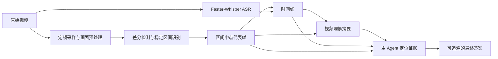

关系 别哭 我是风 正萦绕在你的身边

<!-- more -->

> 文档性质：当前实现说明与设计复盘
> 代码核对日期：2026-07-24
> 适用范围：仓库当前的 OpenCV 稳定帧抽取、Faster-Whisper 转写、时间线生成、视频理解摘要与主 Agent 取证流程

# 技术摘要

视频不能直接交给当前 Data Agent：主 Agent 的上下文由文本和图片组成，不能像人一样拖动进度条、连续观看视频。我们的解决办法不是“让模型直接看完整视频”，而是先把视频转换成一组可检索、可审计的静态证据：

1. 用 OpenCV 顺序解码视频，以固定频率采样画面。
2. 将采样画面缩小、灰度化、模糊化，再计算相邻样本的变化像素比例。
3. 只有一个样本的前后两次画面变化都低于阈值，才把它视为稳定样本。
4. 把连续稳定样本合并为稳定区间，过滤过短区间，并选择区间中点对应的原始分辨率帧作为代表帧。
5. 用 Faster-Whisper 转写音轨，将语音片段与稳定区间按时间重叠关系对齐。
6. 先由视频理解 Agent 逐段阅读时间线和全部稳定帧，生成导航性摘要。
7. 主 Agent 根据摘要定位证据，再读取原始稳定帧；任何用于最终答案的视觉事实，都必须绑定到实际读过的图片和视觉证据回执。

整条链路可以概括为：



这里最重要的边界是：

- 我们检测的是**解码后画面的稳定性**，不是 H.264 码流的大小、I 帧或 GOP 结构。
- “稳定帧”不是“某一张变化很小的图片”，而是“处于一个前后都安静的连续区间中的代表帧”。
- 视频理解摘要只是地图，不是最终证据。最终视觉事实仍需回到原始稳定帧确认。

# 为什么视频任务需要预处理

KDD Cup 的上下文视频往往是屏幕录制：用户打开页面、选择筛选器、输入参数、观察图表，再切换到另一个状态。真正有用的信息通常集中在少数停留画面中，而鼠标移动、滚动、动画和页面切换会产生大量过渡帧。

如果按照固定间隔机械截图，会遇到三个问题：

- 很容易截到滚动一半、动画一半或页面切换一半的模糊状态。
- 同一个页面停留几十秒会产生大量重复截图，挤占多模态上下文。
- 截图与语音彼此分离，模型难以知道“这句话”对应“哪个画面”。

因此，我们把视频预处理设计成两个并行通道：

| 通道     | 处理对象     | 产物                       | 主要用途               |
| -------- | ------------ | -------------------------- | ---------------------- |
| 视觉通道 | 解码后的画面 | 稳定区间、代表帧、差分日志 | 保存关键界面状态       |
| 语音通道 | 视频音轨     | 带起止时间的 ASR 片段      | 保存操作解释与任务约束 |

两个通道最终在统一时间线上汇合。

# 阶段一：构造隔离的生成上下文

视频预处理不是在原始任务目录中直接修改文件，而是由 `prepare_task_context` 创建一份生成上下文 overlay：

- 原始文档、图片等上下文被保留。
- 支持的视频文件被识别，但原始视频不会作为主 Agent 的可见资产直接挂载。
- 每个视频被替换为可读时间线和稳定帧图片。
- 每次运行会重建本次生成上下文和对应的视频预处理产物，避免旧结果混入。

当前识别的扩展名包括：

```text
.mp4  .m4v  .mov  .webm  .mkv  .avi
```

这一层的设计目的不是节省磁盘，而是建立清晰边界：

```text
原始上下文：只读事实来源
生成上下文：本次运行可消费的派生材料
任务输出目录：可长期复查的处理日志与副本
```

# 阶段二：稳定帧抽取

## 核心直觉

可以把录屏想象成一位讲解员在翻幻灯片：

- 翻页和动画期间，画面大量变化，不适合截图。
- 页面停住以后，相邻画面几乎一致，适合阅读。
- 与其在“翻页动作”中找一帧，不如先找出一段真正安静的时间，再从这段时间的中间取图。

我们的稳定帧算法正是这个思路。它不猜测视频编码器什么时候写入 I 帧，而是直接观察“人最终能看到的像素”。

## 第一步：按目标频率采样

`extract_stable_frames` 首先读取视频的：

- 原始帧率 `fps`
- 总帧数 `frame_count`
- 估算时长 `duration`

目标采样频率记为 $f_s$。代码并不是对视频做随机 seek，而是顺序解码所有帧，只在满足采样步长的位置保留分析样本：

```text
sample_every = max(1, round(video_fps / requested_sample_fps))
actual_sample_fps = video_fps / sample_every
sample_interval = 1 / actual_sample_fps
```

例如，视频是 30 FPS，目标采样频率为 2 FPS：

```text
sample_every = round(30 / 2) = 15
```

系统每解码 15 帧保留一个分析样本，约每 0.5 秒检查一次画面。由于帧率不一定能被目标频率整除，manifest 同时记录请求频率和实际频率。

## 第二步：把画面变成适合比较的“草图”

每个分析样本都会经过 `preprocess_frame_for_diff`：

1. 按比例缩放到目标宽度，默认是 320 像素。
2. 从 BGR 彩色图转换为灰度图。
3. 使用 $3 \times 3$ 高斯模糊。

这一步只服务于变化检测，不会覆盖最终保存的图片。

缩小画面可以降低计算量；灰度化让算法专注于结构和亮度变化；轻微模糊可以抑制视频压缩噪点、字体边缘抖动和单像素扰动。可以把它理解成：先眯起眼睛看页面，只判断“整体布局有没有动”，而不是追究每个像素的微小误差。

## 第三步：计算相邻样本的变化像素比例

设相邻预处理图像为 $I_{i-1}$ 与 $I_i$。代码先计算绝对差：

$$
D_i(x,y)=|I_i(x,y)-I_{i-1}(x,y)|
$$

当某个像素的灰度差大于 `pixel_delta` 时，才把它视为真正变化。默认：

```text
pixel_delta = 25
```

相邻样本的变化像素比例为：

$$
r_i=
\frac{
\#\{(x,y)\mid D_i(x,y)>\text{pixel\_delta}\}
}{
\text{图像总像素数}
}
$$

`r_i` 的含义是“从上一个采样时刻到当前时刻，有多大比例的画面发生了足够明显的变化”。

这里有两层阈值，不能混淆：

| 参数               | 判断对象             | 默认值 | 含义                                     |
| ------------------ | -------------------- | -----: | ---------------------------------------- |
| `pixel_delta`    | 单个灰度像素         |     25 | 一个像素至少变化多少才算动了             |
| `diff_threshold` | 整幅图的变化像素比例 |  0.025 | 有多少比例的像素变化后，认为画面发生转场 |

例如 `diff_threshold=0.025` 表示：如果超过 2.5% 的分析画面像素发生明显变化，本次相邻样本差分就被标记为 transition。

## 第四步：用“双侧安静”判定稳定样本

这是当前算法最关的一步。

对第 $i$ 个采样画面，代码同时检查：

- 进入它之前是否安静：$r_i \le T$
- 离开它之后是否安静：$r_{i+1} \le T$

其中 $T$ 是 `diff_threshold`。只有两边都满足，样本 $i$ 才是稳定样本：

$$
\text{stable}(i)=
(r_i\le T)\land(r_{i+1}\le T)
$$

视频首尾没有完整的两侧，代码对缺失的一侧视为通过，只检查存在的相邻差分。

这个规则相当于要求候选画面位于安静区间内部：

```text
前一张 ──变化小──> 候选帧 ──变化小──> 后一张
                    ↑
                 才算稳定
```

若只检查前一侧，转场刚结束的边缘帧可能被误收；若只检查后一侧，转场刚开始的边缘帧也可能混入。双侧判定会主动丢掉变化区间两端的样本，换取更干净的代表画面。

## 第五步：把稳定样本合并成稳定区间

通过判定的采样索引会由 `group_consecutive` 合并。只有索引连续的样本才属于同一稳定区间。

假设 2 FPS 采样后的稳定性如下：

```text
时间       0.0  0.5  1.0  1.5  2.0  2.5  3.0  3.5  4.0
是否稳定    ✓    ✓    ✓    ×    ×    ✓    ✓    ✓    ✓
分组       └─── 区间 A ───┘         └──── 区间 B ─────┘
```

每个稳定区间的估算边界为：

```text
start = 第一个稳定样本的时间
end = 最后一个稳定样本的时间 + 一个采样间隔
stable_duration = end - start
```

若 `stable_duration < min_stable_duration`，整个区间会被过滤。默认最短稳定时间为 1 秒。

这层过滤的作用是排除：

- 动画中的短暂停顿
- 鼠标移动造成的偶然低变化片段
- 只出现一瞬间、很难可靠阅读的界面状态

## 第六步：选择区间中点，而不是转场后的第一帧

对通过时长过滤的稳定区间，代码选择稳定样本序列的中间索引：

```text
representative_index = run[len(run) // 2]
```

随后使用中点时间重新 seek 原始视频，读取原始分辨率画面，并按配置的 JPEG 质量保存。

它选择中点的原因很直观：中点通常离转场开始和下一次转场都更远，界面更可能已经完成渲染，也更少受到渐变、懒加载和鼠标残影影响。

最终图片只在这一刻以原始分辨率读取。320 像素宽的灰度模糊图只用于判断，不用于给模型阅读，因此不会主动牺牲最终截图中的文字清晰度。

## 第七步：保存可审计的差分产物

每个视频都会保存：

- 稳定代表帧 JPEG
- `manifest.json`
- `frame_diff_scores.csv`

`frame_diff_scores.csv` 对每个分析样本记录：

```text
sample_index
time_sec
changed_pixel_ratio
is_transition
```

manifest 则记录：

- 视频基础信息
- 请求和实际采样频率
- 差分阈值
- 单像素阈值
- 最短稳定时间
- 分析图宽度
- 采样数、稳定区间数、保存帧数
- 每个稳定区间的起止时间、代表时间和图片路径

这使“为什么在 19 秒保存了一张图、为什么 20 秒没有保存”成为可以复查的问题，而不是不可解释的模型行为。

## 一个完整的稳定帧示例


上图是对 `task_21` 运行当前 `extract_stable_frames` 得到的真实结果。该视频时长为 75.8 秒、帧率为 30 FPS；按 `configs/full.yaml` 的参数，以 2 FPS 采样，得到 152 个分析样本。图中的判定参数为：`pixel_delta=25`、`diff_threshold=0.010`、`min_stable_duration=1.0s`、分析宽度 320 像素。

可以沿着图从上到下阅读整个算法过程：

- 蓝线表示每个相邻采样对的画面变化像素比例 $r_i$。这段录屏的大部分页面停留画面在预处理后几乎完全一致，因此蓝线多数时间贴近 0。
- 粉色虚线是 1% 的转场阈值。超过它的橙色圆点就是代码记录的 `is_transition=1`：例如 10.0 秒和 10.5 秒的变化率约为 5.43% 和 8.29%，说明这两个采样间隔中发生了明显页面变化。
- 浅黄色背景和下方同色横条是最终接受的稳定区间，不是“变化率恰好为 0 的单个采样点”。它要求区间内每个候选样本进入前、离开后两侧的变化率都不超过 1%，并且整段至少持续 1 秒。
- 黄色菱形是每个稳定区间的中点代表帧。当前代码不会保存区间里的所有截图，而是只在这个中点时刻重新读取原始分辨率视频帧并保存 JPEG。

以开头一段为例：0.5 秒处的变化率约为 4.16%，超过阈值，因此它是转场样本；从 1.0 秒开始，前后差分都回落到阈值以内，连续形成第一个稳定区间 $[1.0, 9.5]$ 秒。该区间持续 8.5 秒，代码选择中点附近的 5.0 秒作为第一张代表帧。随后 10.0 秒和 10.5 秒连续出现峰值，算法不把它们或紧邻的边缘样本作为稳定画面；直到 11.0 秒后才开始第二个稳定区间。

50 秒附近能更清楚看出“双侧安静”的作用：50.0 秒的变化率达到约 13.38%，属于转场；50.5 秒的变化率已降到约 0.02%，并且它之后的样本也保持安静，因此新的稳定区间从 50.5 秒开始，代表帧取在 53.5 秒。也就是说，算法不是看到峰值就立刻截图，而是确认画面已经稳定后，进一步把取帧位置放在稳定区间中部。

这次运行最终得到 7 个稳定区间，并保存 7 张代表帧，时间分别是 5、15、27.5、42.5、53.5、63 和 72.5 秒。最后一个区间在图上标为 $[69.0,76.0]$ 秒；其中 76.0 秒来自代码的区间计算规则“最后稳定样本时刻加一个采样间隔”，并不表示原视频真的超过 75.8 秒。

# 与 Top1 H.264 方案的异同

| 比较维度   | Top1 文档中的方案                        | 当前项目实现                                      |
| ---------- | ---------------------------------------- | ------------------------------------------------- |
| 观察对象   | H.264 压缩码流与包大小                   | OpenCV 解码后的采样画面                           |
| 转场信号   | 编码数据突发、阈值与冷却                 | 变化像素比例超过阈值                              |
| 稳定策略   | 突发后等待回稳，再取稳定画面             | 样本前后两次差分都较小                            |
| 代表位置   | 强调转场后稳定时刻                       | 稳定区间的中点                                    |
| I 帧处理   | 可结合帧类型或码流规律                   | 不读取 I/P/B 帧类型                               |
| 去重与合并 | 文档讨论感知哈希、片段合并等策略         | 当前未实现                                        |
| 优点       | 不必完整理解每张像素图，适合压缩结构分析 | 与编码格式和强制 I 帧弱相关，直接反映最终可见画面 |
| 代价       | 依赖编码器行为和码流特征                 | 需要顺序解码，阈值受动画、视频噪声与页面面积影响  |

# 阶段三：音轨转写

视觉通道之外，`transcribe_video_audio` 使用 Faster-Whisper 直接转写视频音轨。

当前配置项只有：

| 参数                 | 当前常用值 | 作用             |
| -------------------- | ---------- | ---------------- |
| `asr_model`        | `base`   | Whisper 模型规格 |
| `asr_device`       | `cpu`    | 推理设备         |
| `asr_compute_type` | `int8`   | 计算精度         |

当前代码调用模型时没有显式提供：

- 固定语言
- `initial_prompt`
- 自定义 beam search 参数
- VAD 参数
- 领域词表

语言由模型自动判断，结果中保存检测到的语言。每个片段记录：

```json
{
  "start": 12.4,
  "end": 15.8,
  "text": "..."
}
```

与 Top1 ASR 方案相比，我们当前实现更像可靠的基础管线，而不是经过领域 prompt、VAD、术语修正和分段优化的完整 ASR 系统。

> 回看：我们的实现语音ASR效果确实不太理想，对ASR背景知识了解太少，当时让仅仅让AI设计了一个方案，发现可以用之后就没有继续在这里花费心思。如果多和AI聊几轮，并且稍微学习以下相关知识的话，应该可以做的更好。

# 阶段四：按时间重叠构造视频时间线

稳定帧和 ASR 片段通过时间戳对齐。对每个稳定区间 $[s_v,e_v]$，代码选取与之有重叠的语音片段 $[s_a,e_a]$：

$$
\max(s_v,s_a)\le \min(e_v,e_a)
$$


直观地说，先找两个区间中**较晚开始**的时刻 $\max(s_v,s_a)$，再找其中**较早结束**的时刻 $\min(e_v,e_a)$。如果“较晚开始”还没有晚过“较早结束”，这两个区间就至少共享一个时刻；若前者已经在后者之后，则两段时间之间存在空档，不应关联。

每个时间线段包含：

- **稳定区间**起止时间
- 代表帧时间
- 代表帧路径
- 与该稳定区间重叠的 ASR 文本

```
## Segment 1: 00:01.500 - 00:06.000

- Representative time: 00:03.500
- Stable frame: `video/briefing_stable_frames/stable_001_t0003.50s.jpg`
- Transcript in this visual segment:
  - [00:00.000 - 00:05.200] 平台主界面加在完成,由通谷篩选模块已旧续。

## Segment 2: 00:07.000 - 00:12.000

- Representative time: 00:09.500
- Stable frame: `video/briefing_stable_frames/stable_002_t0009.50s.jpg`
- Transcript in this visual segment:
  - [00:06.200 - 00:11.600] 行业分类自点同步完成,二级行业节点已全部展开。
```

时间线末尾还会追加完整转写。这样做是为了保留：

- 发生在非稳定画面期间的语音
- 跨越两个稳定区间的解释
- 无法与任何代表帧对齐的开场、过渡和结尾信息

代价是同一语音片段可能同时出现在相邻区间和完整转写中。这里选择“允许重复但不丢信息”，而不是为了文本整洁删除潜在证据。

> 回看：这种合并方法现在看其实有些问题，如果一句语音的开头在上一稳定画面的结尾处开始说，这句换更应该被趋向于下一个稳定画面的语音证据，但当前实现会在两个片段中重复保留这句话。

# 阶段五：视频理解 Agent 生成导航摘要

在主 Data Agent 启动前，`runner.py` 会检查生成上下文中是否存在视频时间线。若存在，则调用 `add_video_understanding_summaries`。

视频理解 Agent 收到：

1. 完整时间线文本；
2. 该视频的全部稳定帧；
3. 图片编号与文件路径的明确映射。

图片以 base64 形式按 `detail: high` 附加。当前实现会把该视频的全部稳定帧交给这个预主 Agent，并不会使用 `max_attached_frames` 截断这里的图片数量。

提示词要求它按时间顺序逐段处理，不能跳段，并输出：

- 每段的精确时间范围
- 对应的原始 ASR 文本
- 画面中可见的页面、控件、数值、图表、文本与状态
- 操作流程叙事
- 信号标签，例如 `[TASK]`、`[CONFIG]`、`[FILTER]`、`[BOUNDARY]`、`[EXCLUDE]`、`[DEMO]`、`[CLOSE]`
- 叙事主线
- 关键信号
- 完整转写回顾
- 不确定项

它的任务是把“很多时间线段和截图”压缩成一张导航地图，而不是回答最终数据问题。

## 为什么要做前置 Video Understanding Agent

最开始我们没有设计 Video Understanding Agent，而是直接让 Data Agent 读取视频时间线文件 `timeline.md`，其中仅包含：

* 视频时间段
* 该段对应的图片文件
* 该段的语音转文字

示例如下：

```
## Segment 2: 00:16.000 - 00:22.500

- Representative time: 00:19.000
- Stable frame: `video/briefing_stable_frames/stable_002_t0019.00s.jpg`
- Transcript in this visual segment:
  - [00:14.840 - 00:22.480] 你看 這個近12個月把相零批次的幾個項目也帶進來了 這不是我要的範圍
  - [00:22.480 - 00:29.040] 批次管理 這裡才是按自然年度歸盪的 我找一下對應的那個批次
```

然后 Data Agent 可以根据段落的语音内容，通过调用工具，只去读模型判断**必要**的图片，获取图片中的详细信息。同时我们增加了**图片压缩**机制：

* 模型读取一个图片时，我们只在读取的这一轮模型调用上下文中塞入完整的图片 base64 编码。
* 模型读取图片后，会在思考或返回文本内容中说明从图片中提取到的信息。
* 后续我们使用模型提取的文本信息，代替在上下文中完整图片编码。

这样做最开始效果不错，但仍存在两个问题：

1. 如果只读必要的图片，容易被单个图片信息误导，不同画面之间的信息联系可能被忽略。
2. 如果强制模型按顺序读取所有图片，一些题目会在前十几个 steps 都用于读图，整体消耗过多步骤。

因此，我们希望用一次前置多模态调用替代主 Agent 的多轮试探式读图，于是单独设置了 Video Understanding Agent。

## 为什么需要工作流叙事与信号图

最初的视频理解文档只是按视频时间顺序，逐段记录稳定画面中的页面元素和对应语音。这种方式能够较完整地保留源视频内容，但得到的仍是一组平铺片段，不同片段之间的逻辑关系需要下游 Data Agent 自行推断。

在实际使用中，下游模型有时能够关联前后片段，有时却只关注单个画面，容易忽略“错误配置—修正操作—正确口径”之间的过程，也可能把演示数据误认为最终结果。因此，我们在 Video Understanding Agent 中加入工作流叙事与信号图：先标记每个片段承担的任务、配置、筛选、边界、排除或演示作用，再在文档末尾把整个视频串联成一条完整的操作流程。

这一设计不是让 Video Understanding Agent 提前解决数据任务，而是把分散的逐帧观察组织成具有上下文关系、角色标记和来源定位的证据导航，帮助下游 Data Agent 更稳定地理解筛选条件、数据边界以及仍需进一步查询的内容。

# 阶段六：主 Agent 的证据式消费

## 初始上下文如何装配

若视频理解摘要成功生成，主 Agent 初始上下文优先包含摘要，并告诉模型：

- 摘要只用于定位；
- 应按需阅读原始时间线；
- 任何用于最终答案的视觉事实，都要读取相应稳定帧。

## 材料可以回看形成确定证据

解析视频过程中产出的以下材料：

* 视频时间线文档
* 视频总结文档
* 视频稳定帧

主Agent以及在执行过程中可以再次查看源证据，以确保消除歧义。

# 当前配置画像

视频预处理参数由命令行指定的 YAML 配置决定。仓库没有一个脱离运行配置的“唯一最终阈值”，因此应按配置画像描述。

| 配置                    | `sample_fps` | `diff_threshold` | `pixel_delta` | `min_stable_duration` | `resize_width` | `jpg_quality` | `max_attached_frames` |
| ----------------------- | -------------: | -----------------: | --------------: | ----------------------: | ---------------: | --------------: | ----------------------: |
| `configs/docker.yaml` |            2.0 |              0.010 |              25 |                    1.0s |              320 |              95 |                      32 |

阈值越小，算法越敏感：

- `0.010`：超过 1% 的分析像素变化就判为 transition，更严格地排除微动。
- `0.025`：允许最多约 2.5% 的分析像素明显变化，更能容忍鼠标、光标闪烁和局部动画。

两者不是简单的“越小越好”：

- 阈值过小，会把光标、加载动画或局部数字跳动切成许多短区间。
- 阈值过大，会把滚动、小面积弹窗或筛选器变化误认为稳定。

# 产物目录与可追溯性

生成上下文中，一个视频通常产生：

```text
<generated_context>/
├── video/
│   ├── briefing_timeline.md
│   ├── briefing_video_summary.md
│   └── briefing_stable_frames/
│       └── stable_*.jpg
└── generated_asset_manifest.json
```

# 结论

当前视频理解方案不是一个单独的“抽帧脚本”，而是一条分层证据管线：

```text
确定性视觉压缩
  + 带时间戳的语音转写
  + 图文时间线
  + 多模态导航摘要
  + 主 Agent 原图复核
  + 视觉证据校验
```

它的核心价值不只是减少图片数量，而是把连续、难以审计的视频，转换为一组带时间、带路径、带处理参数、带原始证据回执的离散材料。

目前最值得继续增强的方向有三个：

1. 真实录屏上的阈值评估与自适应采样。
2. 保留时间语义的稳定帧去重和分块摘要。
3. 从自然语言画面描述扩展到可追踪坐标的版面结构表示。

在这些增强完成之前，文档和对外表述都应坚持区分：哪些是 Top1 的启发，哪些是当前代码已经实现的能力，哪些仍是后续方案。
