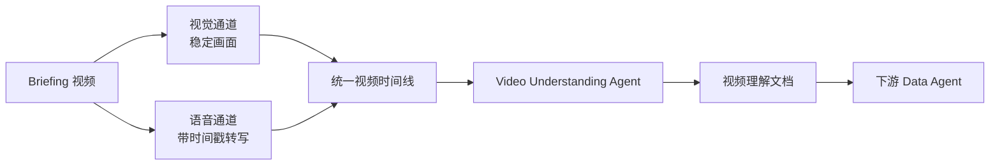
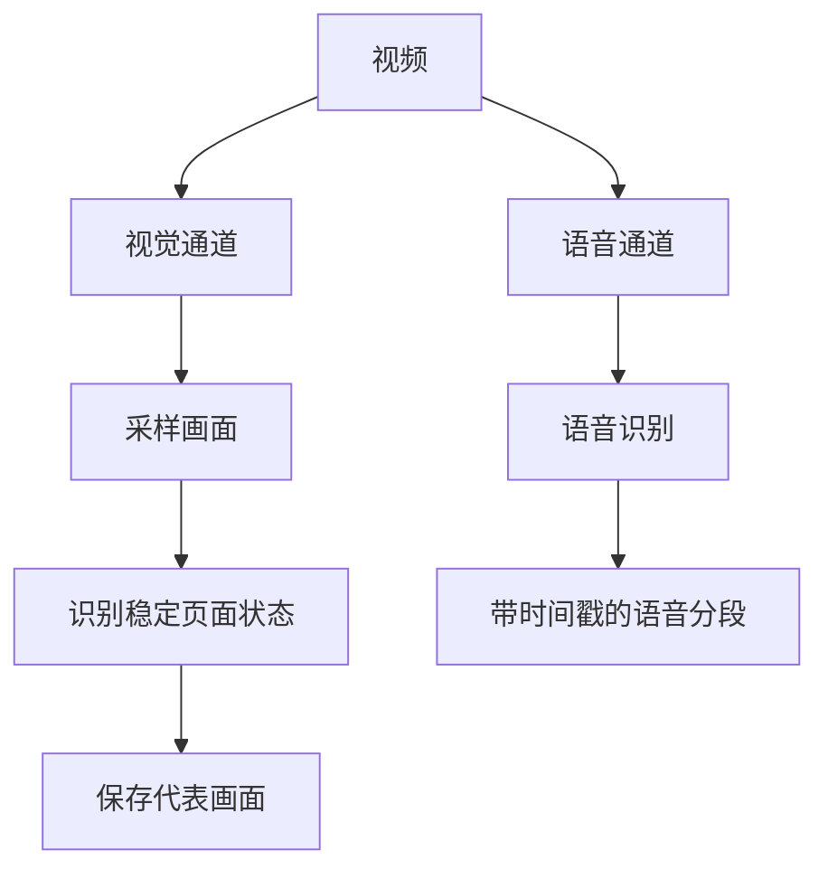

没关系 别哭 我是风 正萦绕在你的身边

<!-- more -->

## 1. 技术摘要

比赛任务中的 briefing 视频既包含语音，也包含页面操作、筛选条件、字段名称、边界示例和干扰项提示。只转写语音会丢失画面信息，只让大模型直接观看完整视频又会带来上下文过长、证据难以定位和结果难以复核的问题。

当前项目采用“先结构化视频，再交给 Data Agent”的设计：

1. 识别并接管任务中的视频资产；
2. 分别处理视觉和语音两条信息通道；
3. 按时间把稳定画面与语音转写重新对齐；
4. 由前置 Video Understanding Agent 生成完整的视频理解文档；
5. 将该文档作为导航和规划上下文提供给下游 Data Agent。



该方案的核心是把视频转换成一份：

- 有时间顺序；
- 有语音原文；
- 有视觉描述；
- 有任务信号分类；
- 能定位回原始画面；
- 能在失败时降级使用

的中间证据文档。

## 2. 整体阶段划分

当前方案分为四个阶段：

| 阶段   | 核心任务               | 主要产物               |
| ------ | ---------------------- | ---------------------- |
| 阶段一 | 视频接管与上下文隔离   | 可处理的视频资产       |
| 阶段二 | 视觉、语音双通道预处理 | 稳定画面、带时间戳转写 |
| 阶段三 | 时间对齐与证据组织     | 视频时间线             |
| 阶段四 | 前置视频理解           | 视频理解文档           |

后续章节分别说明每个阶段的目标、设计思想和输入输出。

### 2.1 最终采用的模型

当前完整视频理解方案使用两类模型：

| 环节     | 最终选择                | 主要职责                                       |
| -------- | ----------------------- | ---------------------------------------------- |
| 语音识别 | `faster-whisper base` | 自动检测语言并生成带时间戳的语音分段           |
| 视频理解 | `Qwen3.5-35B-A3B`     | 联合阅读视频时间线和稳定画面，生成视频理解文档 |

Video Understanding Agent 与下游 Data Agent 复用同一个 Qwen 模型服务，但二者职责不同：

- Video Understanding Agent 是一次前置多模态理解调用，只负责整理视频证据；
- 下游 Data Agent 负责基于视频文档和其他数据源完成最终任务。

### 2.2 ASR 参数

完整方案中的 ASR 配置为：

| 参数         |       最终取值 |
| ------------ | -------------: |
| Whisper 模型 |       `base` |
| 执行设备     |            CPU |
| 计算精度     |       `int8` |
| 语言处理     | 转写时自动检测 |

当前没有为 ASR 启用任务相关 `initial_prompt`，也没有单独配置 VAD 或专业词表。它的定位是提供基础的带时间戳语音证据，再由稳定画面和 Video Understanding Agent 补充理解。

> 比赛回忆：ASR这里当时并没有深入理解，这一块过于相信AI，让AI设计了一个能用的方案就直接采取了。甚至不知道还有不同参数的模型选择，也不知道initial_prompt这些东西。

这一选择偏向部署稳定性和资源可控性：

- `base` 的计算成本低于 medium 和 large 系列；
- CPU + `int8` 不依赖 GPU 环境；
- 模型在容器构建阶段预先缓存。

### 2.3 稳定画面参数

最终完整方案使用以下稳定画面参数：

| 参数             |   最终取值 | 设计含义                             |
| ---------------- | ---------: | ------------------------------------ |
| 视频采样帧率     |  `2 FPS` | 每秒分析两个候选画面                 |
| 画面变化比例阈值 |  `0.010` | 超过 1% 的分析像素变化时视为明显变化 |
| 单像素变化阈值   |     `25` | 过滤轻微亮度和编码波动               |
| 最短稳定时间     |   `1 秒` | 页面至少稳定一秒才保留               |
| 差分分析宽度     | `320 px` | 在降低计算量的同时保留 UI 结构       |
| 稳定帧保存质量   | JPEG`95` | 尽量保留表格文字和小字号信息         |

这组参数偏向“不漏掉关键页面状态”：

- `2 FPS` 足以覆盖以页面操作为主的 briefing 视频；
- `1%` 的变化阈值对小范围 UI 更新较敏感；
- 最短稳定时间可以排除大部分转场动画；
- 高质量 JPEG 有利于后续模型识别小字、字段和数值。

它不是面向电影或高运动视频设计的参数，而是针对数据平台操作录屏。

### 2.4 Video Understanding Agent 参数

最终完整方案中的前置多模态模型参数为：

| 参数             |        完整方案取值 |
| ---------------- | ------------------: |
| 模型             | `Qwen3.5-35B-A3B` |
| 温度             |             `0.2` |
| 单次最大输出     |   `16,000 tokens` |
| 本地完整运行超时 |        `1,800 秒` |
| Docker 运行超时  |        `2,400 秒` |
| 输入图片清晰度   |         High detail |

温度保持在 `0.2`，是因为该 Agent 的任务是证据记录而不是创意生成。较低温度可以减少：

- 对页面含义的自由发挥；
- 对模糊文字的猜测；
- 不同运行之间的结构波动。

保留少量非零温度，则允许模型在长视频中组织自然的工作流叙事，而不会把输出限制成机械 OCR 清单。

## 3. 阶段一：视频接管与上下文隔离

### 3.1 阶段目标

当任务上下文中出现视频时，系统首先将视频从普通文件中识别出来，交给专用视频链路处理。

原始视频不会直接进入下游 Data Agent 的初始上下文，而是先转换成文本和图片形式的中间资产。

### 3.2 设计思想

这一阶段遵循“原始资产与可消费资产分离”的原则：

- 原始视频是事实来源；
- 时间线、稳定画面和理解文档是模型可消费的派生资产；
- 下游 Agent 看到统一的逻辑上下文，不需要理解视频文件如何存储和处理；
- 所有派生资产都能追溯到对应的源视频。

这种隔离带来三个好处：

1. 避免把体积较大的视频直接放进模型请求；
2. 让视频与文档、图片等其他上下文使用统一的资产访问方式；
3. 为预处理失败和模型失败保留明确的降级入口。

### 3.3 阶段输出

该阶段不试图理解视频内容，只负责建立后续处理边界：

```text
原始视频
→ 视频专用处理链路
→ 后续生成的视觉、语音和文档资产
```

## 4. 阶段二：视觉与语音双通道预处理

视频信息被拆成视觉和语音两条并行通道。两条通道独立提取信息，在下一阶段按时间重新合并。



### 4.1 视觉通道：提取稳定页面状态

briefing 视频通常是操作员在数据平台中切换页面、配置筛选条件和展示示例。真正有价值的不是页面切换动画，而是切换完成后稳定停留的 UI 状态。

因此视觉通道不采用“固定间隔无差别截图”，而是：

1. 对视频画面进行连续采样；
2. 比较相邻画面的变化程度；
3. 识别持续稳定的页面区间；

### 4.2 语音通道：生成带时间戳转写

语音通道对视频旁白进行识别，并保留：

- 检测到的语言；
- 每段语音的开始时间；
- 每段语音的结束时间；
- 分段文本；
- 完整转写文本。

时间戳是这一阶段最重要的输出。它使系统可以在后续回答：

> 操作者说“这条不在范围内”时，画面上展示的究竟是哪条记录？

## 5. 阶段三：时间对齐与视频时间线

### 5.1 阶段目标

视觉通道得到稳定画面，语音通道得到带时间戳的转写，但两者此时仍是分离的。

时间线阶段负责把它们组织成统一的时间顺序：

```text
稳定区间
+ 代表画面
+ 同一时间窗口内的语音
= 一个完整视频片段
```

### 5.2 时间对齐方法

每张稳定画面都对应一个开始时间和结束时间。系统查找与该时间窗口发生重叠的语音分段，并将它们放入同一个片段。

一个片段由以下信息组成：

- 片段序号；
- 开始和结束时间；
- 代表画面的时间；
- 稳定画面路径；
- 该窗口内的语音转写。

### 5.3 为什么保留完整转写

除了逐片段转写，时间线末尾还保留一份完整语音记录。

原因是：

- 一个语音分段可能跨越两个稳定画面；
- 某些话发生在页面切换期间，没有对应的稳定画面；
- 逐片段拼接可能重复或切断语义；
- 前置 Agent 需要一份连续旁白来恢复视频整体叙事。

因此，逐片段内容负责局部对齐，完整转写负责全局语义。

### 5.4 时间线的角色

视频时间线是整个方案的核心中间层。它同时服务于：

- 前置 Video Understanding Agent；
- 下游 Data Agent 对语音事实的再次读取；
- 运行复盘和问题定位。

它不是一段自由生成的摘要，而是一份由预处理结果确定的、可审计的视频**索引**。

## 6. 阶段四：前置 Video Understanding Agent

### 6.1 阶段目标

时间线解决了“画面与语音如何对齐”，但它仍然没有解释图片里具体展示了什么。

前置 Video Understanding Agent 同时阅读：

- 视频时间线；
- 按时间排列的稳定画面；
- 每张画面的逻辑路径。

然后生成一份结构化、完整、面向下游的视频理解文档。

### 6.2 逐片段视频理解

Video Understanding Agent 按视频原始时间顺序处理每个稳定画面片段，不按主题重新组织，也不跳过看似不重要的片段。

每个片段包含两个部分：

#### 6.2.1 语音记录

Agent 原样保留该时间窗口中的：

- 语音文本；
- 开始和结束时间；
- 无语音状态。

这一部分不进行总结或改写，避免进一步放大 ASR 偏差。

#### 6.2.2 完整视觉描述

Agent 需要尽可能完整地描述画面中的：

- 页面标题和导航；
- 按钮、标签页、开关和链接；
- 表格、卡片和列表；
- 字段名称与具体数值；
- 脚注、提示和警告；
- 选中状态、颜色和强调关系；
- 红框、箭头等视觉标注；
- 页面中的边界示例和对比关系。

对于无法确认的文字，必须显式标记不确定性，而不是猜测。

### 6.3. 工作流叙事与信号分类

完成逐片段记录后，Video Understanding Agent 还会把视频连接成一条操作流程，并为片段标注下游意义。

#### 6.3.1 信号标签

| 标签           | 说明                               |
| -------------- | ---------------------------------- |
| `[TASK]`     | 视频陈述或重述了任务目标           |
| `[CONFIG]`   | 页面配置、模式切换或导航           |
| `[FILTER]`   | 日期、批次、阈值等筛选条件         |
| `[BOUNDARY]` | 展示什么在范围内、什么不在范围内   |
| `[EXCLUDE]`  | 明确需要排除的数据                 |
| `[DEMO]`     | 仅用于演示，不能当作最终答案的数据 |
| `[CLOSE]`    | 保存、导出或结束操作               |

#### 6.3.2 为什么 `[BOUNDARY]` 最重要

许多视频并不直接告诉 Agent 最终答案，而是解释数据口径。例如：

- 近 12 个月与自然年度的区别；
- 当前批次与其他批次的区别；
- 一个日期在范围内，另一个日期不在范围内；
- 某张预览表只是示例，不能直接作为输出。

这些边界决定了下游 SQL 或 Python 应如何筛选真实数据。视频理解阶段需要准确记录边界，但不执行最终筛选。

### 6.4 Narrative Arc

Agent 用简短叙事连接完整流程：

```text
用户要完成什么
→ 初始方式为什么不正确
→ 用户如何修改配置
→ 真正的数据边界是什么
→ 哪些画面只是示例
→ 哪些数据仍需下游查询
```

这种叙事让下游 Data Agent 不必从零拼接所有片段，同时仍可以回到具体片段核对。

### 6.5 关键信号

Agent 还会提取少量下游必须关注的原始信号，例如：

- 明确的警告；
- 页面脚注；
- 过滤条件；
- 范围内外对比；
- 视频中的原始关键短语。

每条信号都必须能定位到具体片段，不能脱离视频证据自由概括。

### 6.6 生成视频理解文档

Video Understanding Agent 的最终产物是一份 Markdown 视频理解文档。

其逻辑结构为：

```text
视频理解文档
├── 使用说明与证据边界
├── 原始视频时间线入口
├── Segment 1
│   ├── 语音记录
│   └── 完整视觉描述
├── Segment 2
│   ├── 语音记录
│   └── 完整视觉描述
├── ...
├── 工作流叙事与信号图
├── 完整转写回顾
└── 不确定项
```

## 7. 下游 Data Agent 的交接方式

### 7.1 交接内容

视频理解文档生成后，被加入任务的统一上下文，并随原始任务一起提供给下游 Data Agent。

同时下游Data Agent获得以下可以选择查询的视频资产：

* timeline.md
* stable_frames/*.jpg

这些资产可以在下游agent有问题时再次读取源信息，以尽力消除歧义。

### 7.2 交接边界

到这里，视频理解阶段结束：

```text
原始视频
→ 可审计时间线
→ 多模态视频理解文档
→ 下游 Data Agent 上下文
```

下游 Agent 如何检索数据、核验画面、执行 SQL/Python 和提交答案，不属于本文范围。

## 8. 关键设计取舍

### 8.1 为什么不直接把完整视频交给下游

直接把整个视频交给下游是baseline的方案，baseline中直接把视频的完整base64编码注入到第一步的背景上下文中。

缺点：

* 视频中很多画面其实都静止不懂，以及过度动画等等内容。占用了太多无关token。上下文越长模型推理越慢，并且模型也容易被噪音分散注意力，导致推理效果下降。

目标：

* 我们处理视频，最初的目的就是精简上下文，减少无关信息，减少上下文中的噪音。

### 8.2 为什么要做前置 Video Understanding Agent

最开始我们没有设计Video Understanding Agent，而是直接让Data agent读取视频时间线文件`timeline.md`，这是一个仅由：

* 视频时间段
* 该段对应的图片文件
* 该段的语音转文字

示例如下：

```
### Segment 2: 00:16.000 - 00:22.500

- Representative time: 00:19.000
- Stable frame: `video/briefing_stable_frames/stable_002_t0019.00s.jpg`
- Transcript in this visual segment:
  - [00:14.840 - 00:22.480] 你看 這個近12個月把相零批次的幾個項目也帶進來了 這不是我要的範圍
  - [00:22.480 - 00:29.040] 批次管理 這裡才是按自然年度歸盪的 我找一下對應的那個批次
```

然后Data agent可以根据段落的语音内容，通过调用工具，只去读模型判断**必要**的图片，获取图片中的详细信息。同时我们增加了**图片压缩**机制：

* 模型读取一个图片时，我们只在读取的这一轮模型调用上下文中塞入完整的图片base64编码。
* 模型读取图片后，会在思考或返回文本内容中说明从图片中提取到的信息。
* 后续我们使用模型提取的文本信息，代替在上下文中完整图片编码。

这样做其实最开始效果不错，但是还是存在一些问题：

1. 如果只读必要的图片，容易被单个图片信息误导。不同画面之间信息可能存在联系。
2. 如果强制模型按照顺序挨个读取所有图片，一些题目开始由错转正，但是模型前十几个steps都在读取图片。整个过程消耗太多steps。

所以我们希望让一次模型调用代替现在多个steps，从而开始单独设置了Video Understanding Agent。

### 8.3 为什么需要工作流叙事与信号图

最初的视频理解文档只是按照视频时间顺序，逐段记录稳定画面中的页面元素和对应语音。这种方式能够较完整地保留源视频内容，但得到的仍是一组平铺的片段，不同片段之间的逻辑关系需要下游 Data Agent 自行推断。

在实际使用中，下游模型有时能够关联前后片段，有时却只关注单个画面，容易忽略“错误配置—修正操作—正确口径”之间的过程，也可能把演示数据误认为最终结果。因此，我们在 Video Understanding Agent 中加入工作流叙事与信号图：先标记每个片段承担的任务、配置、筛选、边界、排除或演示作用，再在文档末尾把整个视频串联成一条完整的操作流程。

这一设计不是让视频理解 Agent 提前解决数据任务，而是把分散的逐帧观察组织成具有上下文关系、角色标记和来源定位的证据导航，帮助下游 Data Agent 更稳定地理解筛选条件、数据边界以及仍需进一步查询的内容。
