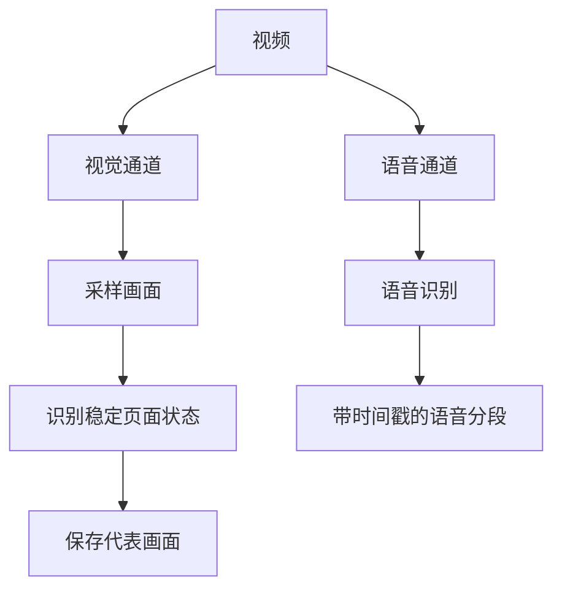

这不是一篇需要从头读到尾的教程，而是一间专门为 **ulBo** 准备的 Markdown 陈列室。你可以快速滚动页面，查看排版节奏、目录跟随、代码高亮、图片懒加载，以及不同内容元素在明暗主题下的表现。

<!-- more -->


## 从一段普通正文开始

好的阅读体验通常并不张扬。它让正文保持舒适的行宽，让段落之间拥有足够的呼吸，也让链接、强调和注释自然地融入句子。比如，你可以访问 [Astro 官方网站](https://astro.build/)，也可以使用 **粗体强调重点**、*斜体表达语气*，或者用 `行内代码` 标记文件名和命令。

中文与 English、数字 2026、符号 `@astrojs/mdx` 混排时，文字仍然应该保持稳定、清晰。较长的段落则用来观察行高与换行：设计不是把所有东西装饰得更复杂，而是帮助读者在内容之间建立层次，在需要停顿的地方停顿，在需要继续的地方自然前进。

> 一个好的主题不应该抢走文章的注意力。
> 它更像安静的展厅：负责光线、距离与方向，把舞台留给内容本身。

### 文本细节

下面集中展示常见的行内语义：

- **这是粗体文字**，适合结论与关键词。
- *这是斜体文字*，适合语气与作品名称。
- ~~这是删除线~~，适合展示修订前的想法。
- `const theme = 'ulBo'` 是一段行内代码。
- [这是一个外部链接](https://docs.astro.build/)，用于观察悬停与访问状态。

---

## 列表与信息层级

列表是长文章里最常见的结构之一。无序列表适合并列信息：

- 清晰的内容层级
- 舒适的阅读宽度
- 稳定的目录定位
  - 二级项目也应该容易辨认
  - 缩进不应破坏正文节奏
- 对移动端友好的交互

有序列表则更适合说明步骤：

1. 写下文章最重要的结论。
2. 用标题建立清晰的章节。
3. 添加图片、代码或数据作为证据。
4. 最后再检查移动端的阅读体验。

任务清单可以展示完成状态：

- [X] 准备文章结构
- [X] 添加原创演示图片
- [X] 覆盖主要 Markdown 样式
- [ ] 写下属于你的下一篇文章

## 图片与长页面节奏

图片不只负责装饰，它还会改变长页面的滚动节奏。下面这张图放在文章中段，可以用来观察图片圆角、最大宽度、懒加载占位，以及加载完成后目录锚点是否仍然稳定。


下面是一张 9:16 的竖向图片，用于观察文章页在桌面与移动端的等比缩放效果；点击图片可查看灯箱中的完整尺寸。


### 为什么图片尺寸很重要

浏览器在图片下载前就知道其宽高时，可以提前留出正确空间，减少内容突然跳动。本站的 Markdown 图片处理会补充尺寸信息，并使用懒加载来平衡首屏速度与滚动体验。

> **提示**：测试目录定位时，可以点击后面的“代码展示”或“数学公式”章节，再快速向上、向下滚动，观察高亮状态与最终停靠位置。

## 代码展示

行内代码适合短小内容，例如 `npm run dev`。完整代码块则用于展示语法高亮、横向滚动和长行换行。

```ts
type Post = {
  title: string;
  description: string;
  tags: string[];
};

const featuredPost: Post = {
  title: 'Designing a calm reading experience',
  description: 'Content first, decoration second.',
  tags: ['Astro', 'Design', 'Markdown'],
};

export const formatTitle = ({ title }: Post) =>
  `${title} — ulBo`;
```

也可以展示命令行内容：

```bash
npm install
npm run dev
npm run build
```

以及一行比较长的代码，用于检查窄屏设备上的处理方式：

```js
const message = posts.filter((post) => post.data.tags.includes('Astro')).map((post) => post.data.title).join(' · ');
```

## 表格展示

表格适合承载需要横向比较的信息。在手机上，它应当保持可读，而不是把整个页面撑宽。

| 元素       | 用途                 | 本文位置 |
| :--------- | :------------------- | -------: |
| 标题与目录 | 建立阅读路径         |     多处 |
| 图片       | 展示视觉内容与懒加载 |     2 张 |
| 代码块     | 展示语法高亮         |     3 组 |
| 表格       | 对比结构化信息       |     2 组 |
| 数学公式   | 技术文章排版         |     2 组 |

### 手机端宽表滚动示例

下面这张四列表格故意保留较多信息，用来检查手机端的横向滑动、完整内容展示和阅读高度。窄屏设备上可以在表格区域内左右滑动，页面本身不会被撑宽。

| 工具 | 接收什么 | 返回什么 | 在流程中的作用 |
| :--- | :--- | :--- | :--- |
| `explore_data` | `\\tables`、`\\schema <表名>` 或只读 SQL | 表清单、字段与样例、查询总行数和结果行 | 找到候选表，并用真实数据验证字段、过滤、去重、Join 与聚合口径 |
| `read_solver` | 读取位置和行数 | 带“行号 + 行 hash”的 `solver.py` 内容 | 看清脚手架查询区，并取得安全编辑所需的定位信息 |
| `edit_solver` | 起止行号、行 hash 和新内容 | 编辑摘要及修改后附近的新 hash | 把口径注释和 SQL 写入唯一允许修改的脚本，语法错误时拒绝落盘 |
| `run_solver` | 自检开关、展示行数和超时 | `FAILED`、`NO OUTPUT` 或 `OK`，以及 CSV 自检 | 执行最终脚本，并把运行错误或结果形态反馈给 Solver |

## 数学公式

行内公式可以自然嵌入句子，例如圆的面积是 $A = \pi r^2$，而独立公式适合展示更完整的推导：

$$
\operatorname{softmax}(x_i) = \frac{e^{x_i}}{\sum_{j=1}^{n} e^{x_j}}
$$

再看一个经典的欧拉恒等式：

$$
e^{i\pi} + 1 = 0
$$

## 更深的标题层级

这一节专门用于观察目录缩进与标题间距。

### 三级标题：组件之间的关系

正文、图片和代码块并不是彼此独立的孤岛。它们共同决定文章的视觉密度，也会影响读者滚动页面时的节奏。

#### 四级标题：一个更细的注释

实际文章不必频繁使用很深的标题层级，但主题仍然应该为它们提供清晰、克制的视觉区别。

### 三级标题：响应式阅读

在桌面端，目录可以帮助快速跳转；在移动端，更重要的是内容宽度、触控区域和不会溢出的代码与表格。

## Mermaid 图表

使用 Office Viewer 同样的标准代码围栏即可在线渲染 Mermaid v11 图表；图表会自动适配博客的明暗主题。


### 纵向流程图（打印示例）

下面这张图用于展示纵向流程图在网页与 PDF 中的自适应尺寸：



## 折叠内容与补充说明

原生 HTML 也可以和 Markdown 一起使用：

<details>
  <summary>点击展开一段补充内容</summary>

  这段文字默认被折叠，可以用来存放答案、补充资料或不影响主线阅读的信息。

</details>

> [!NOTE]
> 如果你的 Markdown 工具链没有启用 GitHub 风格警告框，它会优雅地退化为普通引用块，这同样可以验证兼容样式。

## 结语

现在，这篇文章已经覆盖了 ulBo 文章页最常用的内容类型。你可以把它保留为主题 Demo，也可以在以后修改样式时把它当作视觉回归测试页面。

如果标题、段落、列表、引用、图片、代码、表格和公式在明暗主题与不同屏幕宽度下都能保持协调，那么这个主题就已经为真正的内容做好了准备。
